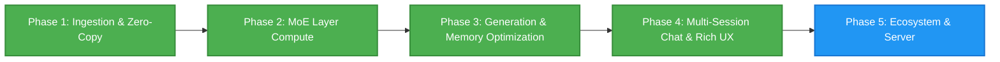

# DynaMoE

*Dynamic, SSD-Streamed Mixture-of-Experts and Dense LLM Inference on Apple Silicon.*

DynaMoE is a high-performance native macOS application, local inference engine, Model Context Protocol (MCP) server, and OpenAI-compatible API host. Engineered specifically for Apple Silicon's Unified Memory Architecture, DynaMoE runs massive Mixture-of-Experts (MoE), newer hybrid attention models (Qwen 3.8 Flash Next), and dense language models that exceed physical system RAM by dynamically memory-mapping and streaming weights directly from high-speed NVMe storage to the GPU.

---

## Inspiration & Acknowledgements

This project was undertaken purely for the joy of exploration by someone who is not a software engineer or even a "real" developer. Just someone who is enjoying learning with the help of AI. I'm steering the ship, and Gemini 3.6 and 3.7 are largely implementing the ideas and pointing me in the right direction.

Special thanks and acknowledgement to the open-source projects that inspired and influenced this architecture:
* **Flash-MoE** (https://github.com/danveloper/flash-moe) by Dan Woods: A huge shoutout and credit to Flash-MoE for pioneering the MoE expert repackaging format and contiguous binary layer storage layout (`packed_experts/layer_XX.bin`). DynaMoE adopts and builds upon Flash-MoE's expert restructuring concepts to enable high-throughput asynchronous POSIX `pread` file streaming directly into shared Metal GPU buffers.
* **Colibri** (https://github.com/JustVugg/colibri): Pioneering work on high-speed off-disk model execution.

---

## Supported Architectures & Models

DynaMoE supports both sparse Mixture-of-Experts and dense autoregressive transformer architectures with automatic model topology detection.

| Model / Family | Parameters | Active Parameters | Architecture Type | Quantization & Precision | Context Window |
| :--- | :--- | :--- | :--- | :--- | :--- |
| **Qwen 3.8 Flash Next** | ~180B (512 Experts + 51B PLE) | ~6B (10 Active + Shared) | Hybrid GatedDeltaNet + QSA Sparse Attention + Gated Residuals | FP8 (MXFP8) / BF16 / NVFP4 | 131,072 / 262,144 |
| **Ornith 1.5 35B A3B** | 35B (256 Experts) | ~3B (8 Active + Shared) | Hybrid GatedDeltaNet + GQA | Q4 Affine / Q8 / BF16 / FP8 (MXFP8) | 262,144 (Native) / 1M+ (YaRN) |
| **Ornith 1.5 9B Dense** | 9B Dense | 9B | Hybrid GatedDeltaNet + GQA | 8-Bit Affine / BF16 / FP16 | 131,072 |
| **Standard Dense LLMs** | 3B – 32B | Full Layer Width | Dense Transformer (LLaMA / Qwen 2.5 / Nanbeige) | Q4 / Q8 / BF16 / FP16 | Model Default |

### Key Architectural Strengths:
* **Hybrid Recurrent SSM + Sparse/Full Attention**: GatedDeltaNet linear recurrent attention layers ($O(1)$ constant-memory state) interleaved 3:1 with Qwen Sparse Attention (QSA) or Grouped-Query Attention (GQA).
* **Massive Fine-Grained Sparsity & High Throughput Routing**: 256–512 routed experts per layer (Top-8 / Top-10 activated per token) plus dedicated Sigmoid-gated shared experts with zero-copy NVMe streaming.
* **4-Stream Gated Residuals & N-Gram PLE Support**: 4 parallel structural residual streams with rank-320 bottleneck read gates and zero-copy Layer 2 N-gram Predictive Local Embedding (PLE) row gathering.
* **Dynamic Architecture Auto-Detection**: Inspects `config.json`, SafeTensors headers, and tensor topologies to automatically configure layer count, hidden dimensions, attention heads, KV heads, RoPE theta, RMSNorm eps, unit offsets, and MLP projection types.

---

## Key Highlights & Capabilities

* **Zero-Copy Apple Silicon Unified Memory Bridge:** Memory-maps multi-gigabyte SafeTensors weight shards via `memmap2` in Rust and wraps raw memory addresses directly into Metal GPU buffers (`MTLBuffer(bytesNoCopy:length:options:deallocator:)` with `.storageModeShared`), eliminating redundant CPU-to-GPU copies.
* **SIMD-Coalesced Metal Compute Kernels:** Custom Metal Shading Language (MSL) compute shaders featuring SIMD-coalesced memory access and threadgroup shared memory caching for packed 4-bit/8-bit affine matrix-vector operations, FP8 (`E4M3`/`E5M2`) with block scales (MXFP8), SwiGLU expert projections (`gate_proj`, `up_proj`, `down_proj`), dynamic Top-8 routing, and token embedding lookups.
* **FlashMoE Contiguous Expert Repackaging & Multi-Threaded Direct I/O:** Inspired by and adapted from Dan Woods' Flash-MoE project, DynaMoE supports restructuring sparse MoE model layers into contiguous per-layer expert binaries (`packed_experts/layer_XX.bin` + `layout.json`). A dedicated 8-thread background POSIX `pread` I/O pool (`ExpertIOThreadPool`) streams selected expert slices directly into shared Metal staging buffers, eliminating file fragmentation and maximizing NVMe read bandwidth during token generation.
* **Quantized FP8 & FP16 KV Cache:** Dynamically configurable KV cache precision (**FP32**, **FP16**, and **FP8 E4M3/E5M2**), reducing attention cache memory footprints by up to 75% and enabling long-context inference (32k+ tokens) on memory-constrained Macs.
* **Speculative MoE Expert Prefetching (`WorkingSetManager`):** Thread-safe background speculative lookahead prefetching pipeline using `posix_madvise(POSIX_MADV_WILLNEED)` to warm upcoming layer experts asynchronously before routing execution, alongside LRU page eviction (`POSIX_MADV_DONTNEED`) to keep RSS within strict hardware thresholds.
* **Hardware-Vectorized Accelerate Sampling:** Apple Accelerate framework integration using `vDSP_maxvi` for zero-overhead greedy sampling, $O(\log K)$ min-heap Top-$K$ candidate tracking, vectorized softmax normalization (`vvexpf`, `vDSP_vsmul`), and dynamic **Min-$P$** and **Top-$P$ (Nucleus)** probability truncation.
* **Universal Reasoning & `<think>` Accordion:** Automatic detection of reasoning/thinking models across Ornith, Qwen 2.5/3.5, DeepSeek-R1, Nanbeige, GLM, and Nemotron with dynamic inspection of `tokenizer_config.json` and `chat_template.jinja`. Renders real-time, collapsible chain-of-thought blocks with duration timers, char counts, and live streaming pace indicators.
* **Rich Markdown & Code Rendering Engine:** High-performance, debounced token streaming UI with full GitHub Flavored Markdown support, including tables with column alignment, blockquotes, callout alerts (`[!NOTE]`, `[!TIP]`, `[!IMPORTANT]`, `[!WARNING]`, `[!CAUTION]`), nested lists, and syntax-highlighted code blocks with one-click copy.
* **Hugging Face Local Cache Auto-Discovery:** Automatically scans `~/.cache/huggingface/hub` on launch to discover all downloaded models, snapshots, weight formats, and quantizations. Allows selecting an overall **Default Model** and automatically tracks the **Last Used Model**.
* **Antigravity-Style Multi-Session Chat UI:** Full multi-session chat workspace with persistent session history, creation, renaming, deletion, and an interactive in-chat dropdown model switcher to swap active models on the fly.
* **Model-Specific System Prompts & Conjunction Merging:** Built-in repository of required instruct personas (e.g. Nanbeige, Qwen, DeepSeek, Ornith). User-customized default system prompts in Settings are combined with model-required prompts *in conjunction* during inference.
* **Up to 10,000 Max Output Tokens & Dynamic KV Cache:** Configurable max output token limit up to 10,000 tokens with quick presets (`512`, `1024`, `2048`, `4096`, `8192`, `10000`) and dynamic Metal KV cache buffer allocation to prevent memory overflows.
* **Native macOS View Menu & Zoom Controls:** Top "View" menu options with standard keyboard shortcuts for **Actual Size** (`⌘0`), **Zoom In** (`⌘+`), and **Zoom Out** (`⌘-`) featuring proportional pixel-perfect geometry scaling.
* **Rust Tokenization Pipeline:** Integrated Hugging Face `tokenizers` library exposed through automated UniFFI Swift bindings for sub-millisecond token encoding and decoding.

---

## Architecture Overview

```text
DynaMoE/
├── DynaMoE/                 # Native macOS App (SwiftUI, Metal GPU Pipelines, Inference Engine)
│   ├── DynaMoEApp.swift     # Application entry point, View menu Zoom commands, and AppZoomManager
│   ├── ContentView.swift    # Core workspace coordinator, Metal compute dispatch, and autoregressive engine
│   ├── ChatDetailView.swift # Antigravity-style chat interface, markdown parser, thinking accordion, model switcher
│   ├── ChatModels.swift     # Multi-session chat models, message state, and persistence
│   ├── LocalModelManager.swift # Hugging Face cache scanner (~/.cache/huggingface/hub) and model registry
│   ├── ModelConfig.swift    # Config parser, architecture detection, and system prompt conjunction resolver
│   ├── SettingsSheetView.swift # Comprehensive Settings: Models, Generation, Memory Modes, and Prompts
│   ├── SidebarView.swift    # Navigation sidebar for chat sessions, model info, and tensor catalog
│   ├── InferenceEngine.swift # GPU pipeline abstractions and compute shaders bridge
│   └── ComputeShaders.metal # MSL Kernels (Q4/Q8 Affine GEMV, SIMD SwiGLU, MXFP8, DeltaNet, GQA, RoPE, RMSNorm)
├── GeneratedFFI/            # Auto-Generated Swift UniFFI Bindings
│   ├── dynamoe_core.swift   # High-level Swift wrapper around Rust engine
│   └── dynamoe_coreFFI.*    # C headers & module maps
├── core/                    # High-Performance Rust Compute Core (`dynamoe-core`)
│   ├── Cargo.toml           # Engine dependencies (memmap2, safetensors, uniffi, tokenizers)
│   └── src/lib.rs           # Multi-shard mmap engine, index parser, tensor catalog, generalized 3D slicing
└── README.md
```

### Technology Stack
* **Frontend UI & Orchestration:** SwiftUI, Swift 6.0+, AppKit, Combine, Apple Accelerate (`vDSP`, `vecLib`)
* **Compute Engine (Rust):** `dynamoe-core`, `safetensors`, `memmap2`, `tokenizers`, `serde_json`, `uniffi`
* **GPU Compute (Metal):** Metal Shading Language (MSL), Metal Performance Shaders, SIMD matrix optimizations
* **Interoperability:** Zero-overhead UniFFI FFI bindings compiled automatically via Xcode build phases

---

## Project Roadmap



### Phase 1: Foundation & Zero-Copy Ingestion ✅ *(Completed)*
- [x] Project architecture, licensing, and repository setup.
- [x] Automated Rust $\leftrightarrow$ Swift UniFFI compilation pipeline integrated into Xcode.
- [x] Multi-shard SafeTensors index parser & Hugging Face cache snapshot/blob resolver.
- [x] Zero-copy `MTLBuffer` unified memory bridge passing page-cache addresses directly to Metal.
- [x] Fast Rust tokenizer integration (`tokenizers`) with live encoding/decoding playground.
- [x] Native Metal compute kernels for MXFP8, Q4, Q8, and BF16 embedding lookups.

### Phase 2: MoE Routing & Layer Compute ✅ *(Completed)*
- [x] **MoE Top-$K$ Gating Kernel (`mlp.gate.weight`)**: Metal shaders multiplying hidden states against Q4/Q8/FP8 router weights, applying Softmax, and extracting top-8 expert indices with routing probabilities without pipeline stalls.
- [x] **SIMD-Coalesced Q4/Q8 Affine GEMV & SwiGLU**: Threadgroup-cached 4-bit/8-bit dequantization matrix-vector multiplication with SiLU activation and Hadamard product for expert projections (`gate_proj`, `up_proj`, `down_proj`).
- [x] **Shared Expert & Accumulation Pipeline**: Parallel GPU dispatch across top-8 active experts and Sigmoid-gated shared expert, weighted accumulation into post-MLP hidden state vector $h_{\text{mlp}}$.
- [x] **Hybrid GatedDeltaNet SSM & GQA Attention**: Causal Conv1D, linear attention recurrent step, L2 head norm, per-head RMSNorm, partial RoPE, and fused GQA decode.
- [x] **Hardware-Aware Unaligned Memory Loading**: Robust unaligned byte reading in Metal shaders supporting arbitrary SafeTensors header offsets.

### Phase 3: Generation, Sampling & Memory Optimization ✅ *(Completed)*
- [x] **Sequential Multi-Layer Backbone Engine ($h_0 \to h_N$)**: Double-buffered GPU layer loop chaining dynamic Top-8 MoE routing, SwiGLU expert dispatch, RMSNorm, SSM DeltaNet, and GQA attention.
- [x] **Dense Transformer Engine**: Dedicated compute path supporting dense LLMs (e.g., Nanbeige 4.2 3B, Ornith 9B, Qwen 2.5, LLaMA) with standard dense MLPs and RMSNorms.
- [x] **Quantized FP8 / FP16 KV Cache**: Configurable KV cache precision (FP32, FP16, FP8) with dedicated fused storage and attention decode kernels.
- [x] **Speculative MoE Expert Prefetching (`WorkingSetManager`)**: Asynchronous multi-layer lookahead prefetching (`POSIX_MADV_WILLNEED`) and LRU working set eviction (`POSIX_MADV_DONTNEED`).
- [x] **Hardware-Vectorized Accelerate Sampling**: Apple Accelerate (`vDSP_maxvi`, `vvexpf`) greedy and min-heap Top-$K$ sampling, adaptive **Min-$P$**, and **Top-$P$ (Nucleus)** truncation.
- [x] **Dynamic KV Cache & Max Output Tokens**: Configurable limit up to 10,000 output tokens with dynamic buffer growth.

### Phase 4: Multi-Session Chat & User Experience ✅ *(Completed)*
- [x] **Hugging Face Cache Auto-Discovery**: Automatic discovery of local models in `~/.cache/huggingface/hub` with size computation and model registry.
- [x] **Multi-Session Chat Workspace**: Antigravity-style session history, creation, renaming, and persistent session state.
- [x] **In-Chat Model Switcher**: Fast dropdown menu below chat input to switch active models with automatic session retention.
- [x] **Universal Thinking / `<think>` Visualization**: Expandable/collapsible reasoning view with live token count, duration timers, streaming pace indicators, and toggleable reasoning prefill.
- [x] **Rich Markdown & Code Block Engine**: Full GitHub Flavored Markdown renderer with table support, callout alerts, blockquotes, and syntax-highlighted code blocks with one-click copying.
- [x] **Model-Specific System Prompts & Conjunction Merging**: Automatic injection of mandatory instruct prompts combined with user-saved default system prompts.
- [x] **Native macOS View Menu Zoom**: Zoom In (`⌘+`), Zoom Out (`⌘-`), and Actual Size (`⌘0`) with proportional geometry scaling.

### Phase 5: Local Server & Ecosystem Integration 🚀 *(In Progress)*
- [ ] Embedded OpenAI-compatible HTTP server (`/v1/chat/completions`, `/v1/models`).
- [ ] Native Model Context Protocol (MCP) server for local tool execution and agent integration.
- [ ] Configurable YaRN RoPE scaling UI toggle for long-context execution up to 1M tokens.
- [ ] Real-time SSD read bandwidth, GPU compute utilization, and memory pressure diagnostics.

---

## Getting Started

### Prerequisites
* macOS 14.0+ (Sonoma or Sequoia recommended)
* Apple Silicon Mac (M1/M2/M3/M4, 16 GB+ Unified Memory recommended)
* Xcode 15.0+ with Command Line Tools
* Rust toolchain (`curl --proto '=https' --tlsv1.2 -sSf https://sh.rustup.rs | sh`)

### Building and Running
1. Clone the repository:
   ```bash
   git clone https://github.com/derekrparris/DynaMoE.git
   cd DynaMoE
   ```
2. Build the Rust core and generate UniFFI bindings:
   ```bash
   cd core
   cargo build --release
   cargo run --bin uniffi-bindgen generate --library target/release/libdynamoe_core.dylib --language swift --out-dir ../GeneratedFFI
   cd ..
   ```
3. Open `DynaMoE/DynaMoE.xcodeproj` in Xcode.
4. Press **Cmd + R** to build and launch DynaMoE.
5. On startup, DynaMoE automatically scans your `~/.cache/huggingface/hub` directory for downloaded models. Open **Settings (⌘,) $\to$ Models** to select your default model, or select any discovered model directly from the chat dropdown!

---

## License

Distributed under the Apache License, Version 2.0. See [`LICENSE`](LICENSE) and [`THIRD_PARTY_LICENSES.md`](THIRD_PARTY_LICENSES.md) for details.

