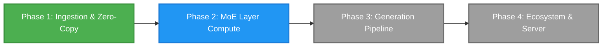

# DynaMoE

*Dynamic, SSD-streamed Mixture-of-Experts LLM inference on Apple Silicon.*

DynaMoE is a high-performance native macOS application, local inference engine, Model Context Protocol (MCP) server, and OpenAI-compatible API host. Engineered specifically for Apple Silicon's Unified Memory Architecture, DynaMoE is designed to run massive Mixture-of-Experts (MoE) language models that exceed physical system RAM by dynamically memory-mapping and streaming expert weights directly from high-speed NVMe storage to the GPU.

---

## Inspiration

This project was undertaken purely for the joy of exploration by someone who is not a software engineer or even a "real" developer. Just someone who is enjoying learning with the help of AI. I'm steering the ship, and Gemini 3.6 and 3.7 are largely implementing the ideas and pointing me in the right direction.

The projects that originally inspired this exploration were:
* **Colibri** https://github.com/JustVugg/colibri
* **Flash-MoE** https://github.com/danveloper/flash-moe

---

## Key Highlights & Capabilities

* **Zero-Copy Apple Silicon Unified Memory Bridge:** Memory-maps multi-gigabyte SafeTensors weight shards via `memmap2` in Rust and wraps raw memory addresses directly into Metal GPU buffers (`MTLBuffer(bytesNoCopy:length:options:deallocator:)` with `.storageModeShared`), eliminating duplicate copies between CPU and GPU.
* **Multi-Shard SafeTensors & Hugging Face Cache Resolver:** Seamlessly loads single-shard and multi-shard models from `model.safetensors.index.json`, automatically traversing Hugging Face `snapshots/` and `blobs/` symlinks to assemble complete model topologies (tested on 35B+ MoE architectures across 14+ shards / 35+ GB).
* **Native Metal Embedding Kernels ($h_0$ Generation):** Custom Metal Shading Language (MSL) compute kernels supporting both packed Microscaling FP8 (**MXFP8** / E4M3 with E8M0 scales) and native **BF16** embeddings, generating initial hidden state vectors ($h_0$) directly in GPU unified memory.
* **Rust Tokenization Pipeline:** Integrated Hugging Face `tokenizers` library exposed through automated UniFFI Swift bindings for sub-millisecond token encoding and decoding.
* **Interactive SwiftUI Architecture Dashboard:** Live inspection of model topologies, per-layer routed expert statistics, memory footprint breakdown, and interactive GPU shader execution.
* **Open & Modular:** Released under the permissive **Apache 2.0** license for open research and community collaboration.

---

## Architecture Overview

```text
DynaMoE/
├── DynaMoE/                 # Native macOS App (SwiftUI, Metal GPU Pipelines, MCP & API)
│   ├── ContentView.swift    # Interactive Model Topology & Tokenizer Dashboard
│   ├── ComputeShaders.metal # MSL Kernels (MXFP8 Dequant, BF16/MXFP8 Embedding Lookup)
│   └── DynaMoEApp.swift     # Application Entry Point & Native macOS Open Dialogs
├── GeneratedFFI/            # Auto-Generated Swift UniFFI Bindings
│   ├── dynamoe_core.swift   # High-level Swift wrapper around Rust engine
│   └── dynamoe_coreFFI.*    # C headers & module maps
├── core/                    # High-Performance Rust Compute Core (`dynamoe-core`)
│   ├── Cargo.toml           # Engine dependencies (memmap2, safetensors, uniffi, tokenizers)
│   └── src/lib.rs           # Multi-shard mmap engine, index parser, tensor catalog
└── README.md
```

### Technology Stack
* **Frontend UI & Orchestration:** SwiftUI, Swift 5.0+, AppKit
* **Compute Engine (Rust):** `dynamoe-core`, `safetensors`, `memmap2`, `tokenizers`, `serde_json`, `uniffi`
* **GPU Compute (Metal):** Metal Shading Language (MSL), Metal Performance Shaders
* **Interoperability:** Zero-overhead UniFFI FFI bindings compiled automatically via Xcode build phases

---

## Project Roadmap



### Phase 1: Foundation & Zero-Copy Ingestion ✅
- [x] Project architecture, licensing, and repository setup.
- [x] Automated Rust $\leftrightarrow$ Swift UniFFI compilation pipeline integrated into Xcode.
- [x] Multi-shard SafeTensors index parser & Hugging Face cache snapshot/blob resolver.
- [x] Zero-copy `MTLBuffer` unified memory bridge passing page-cache addresses directly to Metal.
- [x] Fast Rust tokenizer integration (`tokenizers`) with live encoding/decoding playground.
- [x] Native Metal compute kernels for MXFP8 weight dequantization and BF16/MXFP8 embedding lookup ($h_0$).
- [x] Interactive SwiftUI dashboard for layer inspection, expert distribution, and live GPU kernel execution.

### Phase 2: MoE Routing & Layer Compute 🚀 *(In Progress)*
- [ ] **MoE Top-$K$ Gating Kernel (`mlp.gate.weight`)**: Metal shader multiplying hidden state $h_l$ against router weights, applying Softmax, and extracting top-$K$ expert indices with routing probabilities.
- [ ] **MXFP8 GEMV Compute Kernels**: Fused FP8 dequantization matrix-vector multiplication for feed-forward projections (`gate_proj`, `up_proj`, `down_proj`).
- [ ] **Expert Dispatch & Accumulation Pipeline**: Parallel dispatch to selected active experts, routing weight scaling, and combination with shared expert outputs.
- [ ] **Attention & Normalization Kernels**: RMSNorm pre-normalization, QKV projection kernels, and RoPE / Linear Attention sequence processing.

### Phase 3: Multi-Layer Execution & Autoregressive Generation ⏳
- [ ] Sequential multi-layer execution loop ($h_l \to h_{l+1}$) orchestrating attention and MoE blocks across full depth.
- [ ] Final RMSNorm and `lm_head` projection kernel for vocabulary logit computation.
- [ ] Autoregressive token sampler supporting Greedy, Temperature, Top-$P$, and Repetition Penalties.
- [ ] Dynamic SSD expert paging and predictive prefetching engine for high-throughput inference on constrained RAM.

### Phase 4: Local Server & Ecosystem Integration 🔮
- [ ] Embedded OpenAI-compatible HTTP server (`/v1/chat/completions`, `/v1/models`).
- [ ] Native Model Context Protocol (MCP) server for local tool execution and agent integration.
- [ ] Real-time SSD read bandwidth, GPU compute utilization, and memory pressure diagnostics.

---

## Getting Started

### Prerequisites
* macOS 14.0+ (Sonoma or Sequoia recommended)
* Apple Silicon Mac (M1/M2/M3/M4, Pro/Max/Ultra recommended for large models)
* Xcode 15.0+ with Command Line Tools
* Rust toolchain (`curl --proto '=https' --tlsv1.2 -sSf https://sh.rustup.rs | sh`)

### Building and Running
1. Clone the repository:
   ```bash
   git clone https://github.com/derekrparris/DynaMoE.git
   cd DynaMoE
   ```
2. Build the Rust core and generate UniFFI bindings:
   ```bash
   cd core
   cargo build
   cargo run --bin uniffi-bindgen generate --library target/debug/libdynamoe_core.dylib --language swift --out-dir ../GeneratedFFI
   cd ..
   ```
3. Open `DynaMoE/DynaMoE.xcodeproj` in Xcode.
4. Press **Cmd + R** to build and launch DynaMoE.
5. Click **"Load tokenizer.json"** to select your model's tokenizer, then click **"Select Model Folder / Index"** to load your SafeTensors model folder or `model.safetensors.index.json`.

---

## License

Distributed under the Apache License, Version 2.0. See [`LICENSE`](LICENSE) and [`THIRD_PARTY_LICENSES.md`](THIRD_PARTY_LICENSES.md) for details.

