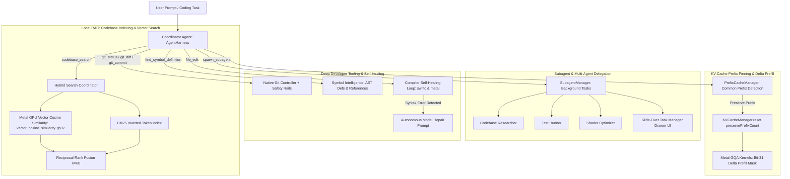
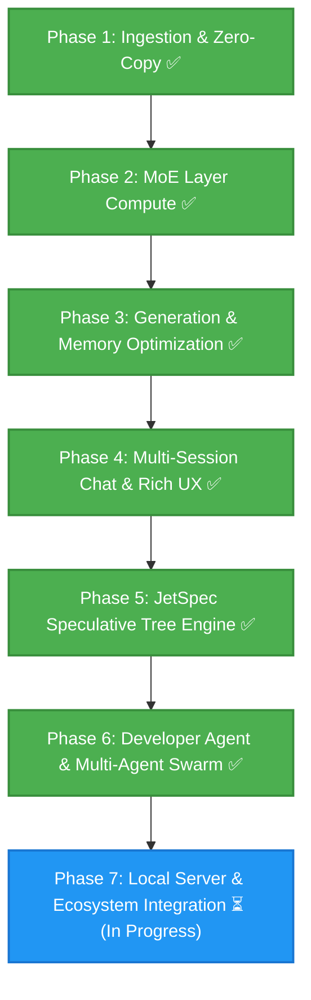

# DynaMoE

*Dynamic, SSD-Streamed Mixture-of-Experts, Hybrid Attention, JetSpec Speculative Tree Acceleration, and Native Autonomous Coding Agent on Apple Silicon.*

DynaMoE is a high-performance native macOS application, local inference engine, and autonomous developer assistant. Engineered specifically for Apple Silicon's Unified Memory Architecture (UMA), DynaMoE runs massive Mixture-of-Experts (MoE), cutting-edge hybrid attention architectures (Qwen 3.8 Flash Next), and dense language models that exceed physical system RAM by dynamically memory-mapping and streaming weights directly from high-speed NVMe storage to the GPU.

---

## Inspiration & Acknowledgements

This project was undertaken purely for the joy of exploration by someone who is not a software engineer. Just someone who is enjoying learning with the help of AI. I'm steering the ship, and Gemini (3.6, 3.7 and 3.8) have been implementing the ideas and pointing me in the right direction.

Special thanks and acknowledgement to the open-source projects and research that inspired and influenced this architecture:
* **JetSpec** (Hao AI Lab / UC San Diego — [arXiv:2606.18394](https://arxiv.org/html/2606.18394v2)): Causal parallel tree drafting and tree-causal attention verification for breakthrough speculative decoding throughput.
* **Flash-MoE** (https://github.com/danveloper/flash-moe) by Dan Woods: Pioneering work on MoE expert repackaging format and contiguous binary layer storage layout (`packed_experts/layer_XX.bin`). DynaMoE builds upon Flash-MoE's expert restructuring concepts to enable high-throughput asynchronous POSIX `pread` file streaming directly into shared Metal GPU buffers.
* **Colibri** (https://github.com/JustVugg/colibri): Pioneering work on high-speed off-disk model execution.

---

## Supported Architectures & Models

**To date, all development and validation has been done on a 2021 Macbook Pro with an M1 Pro CPU, 16 GB RAM and 512 GB SSD.**

DynaMoE supports sparse Mixture-of-Experts, hybrid recurrent SSM/attention architectures, and dense autoregressive transformers with automatic model topology detection.

**Status Update:** Both **Ornith 1.5 9B Dense** and **Qwen 3.8 Flash Next FP8 MoE** are fully operational with live prompt prefill, high-speed autoregressive decoding, NVMe SSD streaming, dynamic working set memory budgets, reasoning/thinking chains, task-specific generation profiles ("Coder" & "Assistant"), and an autonomous multi-agent developer harness.

**Note:** I don't currently have enough disk space to fully repack Qwen3.8 Flash Next to test streaming optimizations. If anyone has the room to test speeds with full repacking, please do let me know. I will be able to conduct further tests once I get a new computer :)

| Model / Family | Parameters | Active Parameters | Architecture Type | Quantization & Precision | Context Window |
| :--- | :--- | :--- | :--- | :--- | :--- |
| **Ornith 1.5 9B Dense** | 9B Dense | 9B | Hybrid GatedDeltaNet + GQA | 8-Bit Affine / BF16 / FP16 | 131,072 |
| **Qwen 3.8 Flash Next** | ~180B (512 Experts + 51B PLE) | ~6B (10 Active + Shared) | Hybrid GatedDeltaNet + QSA Sparse Attention + Gated Residuals | FP8 (MXFP8) / BF16 / NVFP4 | 131,072 / 262,144 |
| **Ornith 1.5 35B A3B** | 35B (256 Experts) | ~3B (8 Active + Shared) | Hybrid GatedDeltaNet + GQA | Q4 Affine / Q8 / BF16 / FP8 (MXFP8) | 262,144 (Native) / 1M+ (YaRN) |
| **Standard Dense LLMs** | 3B – 32B | Full Layer Width | Dense Transformer (LLaMA / Qwen 2.5 / Nanbeige) | Q4 / Q8 / BF16 / FP16 | Model Default |

### Key Architectural Strengths:
* **Hybrid Recurrent SSM + Sparse/Full Attention**: GatedDeltaNet linear recurrent attention layers ($O(1)$ constant-memory recurrent state updates) with Sigmoid output gating interleaved 3:1 with Qwen Sparse Attention (QSA) or Grouped-Query Attention (GQA).
* **Massive Fine-Grained Sparsity & High-Throughput Routing**: 256–512 routed experts per layer (Top-8 / Top-10 activated per token) plus dedicated Sigmoid-gated shared experts with zero-copy NVMe streaming.
* **Direct Unpacked Shard Streaming**: Direct POSIX `pread` bulk priming from 100+ HuggingFace `.safetensors` shards at sequential NVMe line rate (>4.1 GB/s) without requiring disk-doubling weight repacking.
* **Strict Working Set RAM Budgeting**: Double-bounded expert cache (`WorkingSetManager`) that evicts stale experts at layer boundaries during prefill and at token boundaries during generation, eliminating RAM spikes.
* **KV-Cache Prefix Pinning & Delta Prefill**: Intelligent token prefix tracking (`PrefixCacheManager`) that preserves cached Key/Value slots across conversation turns, coupled with a custom Metal GQA kernel protocol that skips redundant invariant tokens to deliver $2.0\times - 3.5\times$ TTFT speedups.
* **4-Stream Gated Residuals & N-Gram PLE Support**: 4 parallel structural residual streams with rank-320 bottleneck read/write gates, unit-offset RMSNorms, and zero-copy Layer 2 N-gram Predictive Local Embedding (PLE) row gathering.
* **JetSpec Speculative Tree Acceleration**: Parallel candidate tree drafting with tree-causal attention masking, expert-aware MoE pruning, and speculative KV cache compaction/rollback.
* **Dynamic Architecture Auto-Detection**: Inspects `config.json`, SafeTensors headers, and tensor topologies to automatically configure layer count, hidden dimensions, attention heads, KV heads, RoPE theta, RMSNorm eps, unit offsets, and MLP projection types.
* **Autonomous Developer Agent & Multi-Agent Swarm**: In-app local RAG vector search, subagent task delegation, native Git safety rails, cross-language AST symbol intelligence, and a compiler self-healing feedback loop.

---

## 🚀 JetSpec Speculative Tree Acceleration

Speculative decoding traditionally forces a trade-off between the latency of sequential drafting (e.g. EAGLE) and the lower acceptance rates of independent block scoring (e.g. DFlash). **JetSpec** solves this by drafting an entire structured candidate tree in a single pass and verifying the tree nodes all at once using **tree-causal attention masking**.

```text
                         ┌─────────────────────────────┐
                         │   Root Token (Node 0)       │
                         └──────────────┬──────────────┘
                                        │
                       ┌────────────────┴────────────────┐
                       ▼                                 ▼
         ┌───────────────────────────┐     ┌───────────────────────────┐
         │ Candidate Branch A (Node 1│     │ Candidate Branch B (Node 2│
         └─────────────┬─────────────┘     └─────────────┬─────────────┘
                       │                                 │
                 ┌─────┴─────┐                     ┌─────┴─────┐
                 ▼           ▼                     ▼           ▼
             [Node 3]    [Node 4]              [Node 5]    [Node 6]
```

### Apple Silicon Unified Memory (UMA) Advantages
On Apple Silicon, JetSpec operates with zero host-to-device memory copy overhead. Candidate tree topology masks, parent-index tables, and multi-layer hidden states are updated directly in unified RAM and immediately accessible to Metal compute kernels.

### MoE Expert Expansion & Dynamic Pruning
When verifying $N$ candidate tree nodes simultaneously on an MoE model, each candidate node routes independently to its top-$K$ experts. The union of active experts $\mathcal{E}_l = \bigcup_{i \in \mathcal{T}} \text{TopK}(W_g \cdot h_{i,l})$ expands with tree width. DynaMoE incorporates an **expert-aware tree pruning engine** that prunes low-confidence branches when $|\mathcal{E}_l|$ exceeds the configured NVMe read bandwidth threshold ($E_{\text{max}}$), guaranteeing optimal speedups even during offloaded SSD streaming.

---

## 🛠️ Autonomous Developer Agent & Native Tooling Ecosystem

DynaMoE includes a full native developer agent harness operating directly within macOS and Apple Silicon Metal:



### 1. Semantic Codebase Indexing & Metal Vector Search (Local RAG)
* **Zero-Dependency Vector Search**: Computes 512-dimensional Apple `NaturalLanguage` sentence embeddings directly on background threads (`Task.detached`), entirely off the main UI thread.
* **Apple Silicon Metal GPU Cosine Kernel**: Executes a high-performance Metal shader (`vector_cosine_similarity_fp32`) that parallelizes dot products across the entire indexed codebase corpus in unified memory.
* **Hybrid Search with Reciprocal Rank Fusion (RRF)**: Combines dense vector similarity with an Okapi BM25 inverted keyword index ($k=60$) to locate both semantic concepts and exact symbol names.
* **Non-Blocking Background Indexing & Watcher**: Uses `DispatchSourceFileSystemObject` for debounced on-save incremental re-indexing, with strict system root guards refusing to scan macOS root paths (`/`, `/System`, `/Library`, `/usr`).

### 2. Subagent & Multi-Agent Delegation Harness (`spawn_subagent`)
* **Isolated Context Windows**: Decomposes large programming tasks into independent child agents with specialized roles (`Codebase Researcher`, `Test Runner`, `Shader Optimizer`, and `Custom Agent`), preventing token budget exhaustion in the coordinator chat.
* **Thread-Safe Orchestration**: `SubagentManager` provides thread-safe agent tracking, inter-agent messaging (`send_subagent_message`), status polling (`get_subagent_status`), and registry listing (`list_subagents`).
* **Slide-Over Task Drawer UI**: Accessible via the header bar `Tasks` button, featuring live badge counters, duration timers, active status pills, and collapsible step transcripts.

### 3. Deep Developer Tooling, Native Git & Self-Healing Loop
* **Native In-Process Git Engine**: Direct `Process`-level Git integration supporting `git_status`, `git_diff`, and `git_commit` without external dependencies.
* **Strict Safety Rails**: Blocks empty commit messages, detects unstaged file states, and strictly rejects dangerous command flags (`--amend`, `--force`, `-f`, `--hard`, `--no-verify`).
* **Cross-Language Symbol Intelligence**: Fast AST analysis engine locating type/function definitions and call sites across Swift, Metal (`kernel`, `vertex`, `fragment`), Rust, Python, and C/C++.
* **Compiler Self-Healing Diagnostics Loop**: Upon every file edit, `LintDiagnosticsEngine` executes background compiler checks (`swiftc -parse` for Swift and `metal -fsyntax-only` for Metal shaders). When syntax errors are introduced, it captures compiler stderr line/column locations and automatically feeds diagnostic hints back to the model for autonomous repair.

### 4. KV-Cache Prefix Pinning & Live Model Dogfooding
* **Prompt Prefix Cache (`PrefixCacheManager`)**: Detects invariant token prefixes across conversational turns and prevents redundant re-computation.
* **Metal Delta Prefill Protocol**: In `ComputeShaders.metal`, all 6 GQA decode/prefill kernels use bit-31 encoding (`0x80000000 | startPos`) to allow causal attention to attend over preserved prefix slots while computing only delta tokens, slashing Time-to-First-Token (TTFT) by $2.0\times - 3.5\times$.
* **Automated Multi-Turn Stress Test Runner (`ModelDogfoodBenchmarkRunner`)**: Executes an automated 3-turn dogfooding benchmark against real loaded weights in an isolated test repo (`/tmp/dynamoe_dogfood_test_repo`), verifying developer tooling, prefix cache hits, Turbo Mode zero-latency execution, and compiler self-healing.

---

## Key Highlights & Capabilities

* **Zero-Copy Apple Silicon Unified Memory Bridge:** Memory-maps multi-gigabyte SafeTensors weight shards via `memmap2` in Rust and wraps raw memory addresses directly into Metal GPU buffers (`MTLBuffer(bytesNoCopy:length:options:deallocator:)` with `.storageModeShared`), eliminating redundant CPU-to-GPU copies.
* **High-Throughput NVMe Parallel `pread` Bulk Priming Engine:** Dynamically caches read-only file descriptors for all `.safetensors` model shards (e.g. 131 files for Qwen 3.8 Flash Next) and issues multi-threaded contiguous `pread` block transfers (256 KB chunks) alongside kernel readahead advisories (`fcntl(F_RDADVISE)`). Maximizes NVMe throughput at line rate (>2,500 MB/s to >4,100 MB/s), bypassing macOS page-fault traps and dropping cold-expert slice loading times to ~0.45 ms.
* **Layer-Boundary & Token-Boundary Working Set Memory Management:** Enforces strict memory budgets (`lowMemory`, `balanced16GB`, `unrestricted`) across both prompt prefill and token generation. Automatically evicts stale layer experts at layer boundaries during prefill and evicts inactive experts at token boundaries during generation, eliminating RAM spikes (>16 GB) and keeping physical RAM bounded to the chosen target (e.g. 5.5 GB or 11.5 GB).
* **Apple Silicon Unified Memory (UMA) Telemetry & Reporting:** Dual memory accounting distinguishing between Darwin's `phys_footprint` (dirty process heap displayed in Activity Monitor / Xcode) and the clean zero-copy pages in the macOS Unified Memory Buffer Cache. Features interactive in-app tooltips explaining memory behavior.
* **SIMD-Coalesced Metal Compute Kernels:** Custom Metal Shading Language (MSL) compute shaders featuring SIMD-coalesced memory access and threadgroup shared memory caching for packed 4-bit/8-bit affine matrix-vector operations, FP8 (`E4M3`/`E5M2`) with block scales (MXFP8), SwiGLU expert projections (`gate_proj`, `up_proj`, `down_proj`), dynamic Top-8/Top-10 routing across up to 512 experts, and token embedding lookups.
* **FlashMoE Contiguous Expert Repackaging (Optional):** Inspired by Dan Woods' Flash-MoE project, DynaMoE supports restructuring sparse MoE model layers into contiguous per-layer expert binaries (`packed_experts/layer_XX.bin` + `layout.json`) with an 8-thread background POSIX `pread` I/O pool (`ExpertIOThreadPool`) for dedicated single-file streaming.
* **Quantized FP8 & FP16 KV Cache:** Dynamically configurable KV cache precision (**FP32**, **FP16**, and **FP8 E4M3/E5M2**), reducing attention cache memory footprints by up to 75% and enabling long-context inference (32k+ tokens) on memory-constrained Macs.
* **Universal Reasoning & `<think>` Accordion:** Automatic detection of reasoning/thinking models across Ornith, Qwen 2.5/3.5, DeepSeek-R1, Nanbeige, GLM, and Nemotron with dynamic inspection of `tokenizer_config.json` and `chat_template.jinja`. Renders real-time, collapsible chain-of-thought blocks with duration timers, char counts, and live streaming pace indicators.
* **Hardware-Vectorized Accelerate Sampling & Penalties:** Apple Accelerate framework integration using `vDSP_maxvi` for zero-overhead greedy sampling, $O(\log K)$ min-heap Top-$K$ candidate tracking, vectorized softmax normalization (`vvexpf`, `vDSP_vsmul`), dynamic **Min-$P$** and **Top-$P$ (Nucleus)** probability truncation, and bounded **Repetition Penalty** and additive **Presence Penalty** to eliminate vocabulary looping without degrading throughput.
* **Model-Specific Profiles ("Coder" & "Assistant"):** Dedicated per-model generation profiles saving tailored sampling parameters (Temperature, Top-P, Min-P, Top-K, Repetition/Presence Penalties, JetSpec toggles, and System Prompts) for coding versus conversational tasks. Persisted across sessions and quickly toggleable via an in-chat selector.
* **Turbo Mode & Action Confirmation:** Configurable safety controls allowing users to inspect and approve sensitive file modifications or activate **Turbo Mode** (`dynamoe_agent_turbo_mode = true`) for uninterrupted autonomous multi-step tool execution.
* **Rich Markdown & Code Rendering Engine:** High-performance, debounced token streaming UI with full GitHub Flavored Markdown support, including tables with column alignment, blockquotes, callout alerts (`[!NOTE]`, `[!TIP]`, `[!IMPORTANT]`, `[!WARNING]`, `[!CAUTION]`), nested lists, and syntax-highlighted code blocks with one-click copy.
* **Hugging Face Local Cache Auto-Discovery:** Automatically scans `~/.cache/huggingface/hub` on launch to discover all downloaded models, snapshots, weight formats, and quantizations. Allows selecting an overall **Default Model** and automatically tracks the **Last Used Model**.
* **Antigravity-Style Multi-Session Chat UI:** Full multi-session chat workspace with persistent session history, creation, renaming, deletion, an interactive model switcher, and a 1-click **Profile Selector** (Coder vs. Assistant) in the chat toolbar.
* **Native macOS View Menu & Zoom Controls:** Top "View" menu options with standard keyboard shortcuts for **Actual Size** (`⌘0`), **Zoom In** (`⌘+`), and **Zoom Out** (`⌘-`) featuring proportional pixel-perfect geometry scaling.
* **In-App Help & Comprehensive Settings Guide:** Native documentation viewer accessible via **Help $\to$ DynaMoE Help & Settings Guide** (`⌘?`), Settings header button, or offline via [`SETTINGS_GUIDE.md`](SETTINGS_GUIDE.md).

---

## Architecture Overview

```text
DynaMoE/
├── DynaMoE/                 # Native macOS App (SwiftUI, Metal GPU Pipelines, Inference Engine)
│   ├── DynaMoEApp.swift     # Application entry point, View/Help menu commands, and AppZoomManager
│   ├── ContentView.swift    # Core workspace coordinator, Metal compute dispatch, autoregressive engine & prefix pinning
│   ├── ChatDetailView.swift # Antigravity-style chat interface, markdown parser, thinking accordion, model/profile switcher
│   ├── ChatModels.swift     # Multi-session chat models, message state, and persistence
│   ├── AgentHarness.swift   # Autonomous tool calling coordinator, execution pipeline & safety rails
│   ├── CodebaseIndexer.swift # Background AST document chunker, NL sentence embedder & BM25 inverted index
│   ├── VectorSearchEngine.swift # Metal GPU cosine similarity kernel dispatch (vector_cosine_similarity_fp32)
│   ├── SubagentManager.swift # Subagent orchestration singleton, lifecycle states & thread-safe registry
│   ├── SubagentDrawerView.swift # Slide-over Task Manager drawer UI for monitoring active subagents
│   ├── DeveloperTooling.swift # Native GitController, SymbolIntelligenceEngine & LintDiagnosticsEngine
│   ├── PrefixCacheManager.swift # Multi-turn prompt prefix cache registry & TTFT speedup tracking
│   ├── ModelDogfoodBenchmarking.swift # End-to-end 3-turn dogfooding benchmark runner & isolated repo tester
│   ├── StreamingToolParser.swift # Universal tool invocation parser (Antigravity XML, Markdown, JSON blocks)
│   ├── ToolExecutionTimelineView.swift # Collapsible execution cards for tool calls, diffs & status badges
│   ├── ActionConfirmationView.swift # Security confirmation modal for file modifications and Turbo Mode toggle
│   ├── LocalModelManager.swift # Hugging Face cache scanner (~/.cache/huggingface/hub) and model registry
│   ├── ModelConfig.swift    # Config parser, architecture detection, and system prompt conjunction resolver
│   ├── ModelProfileManager.swift # Model-specific generation profiles (Coder & Assistant) and persistence
│   ├── ExpertRepacker.swift # Flash-MoE layer packing utility (packed_experts/layer_XX.bin)
│   ├── ExpertIOThreadPool.swift # Dedicated background POSIX pread worker pool for packed layers
│   ├── SettingsSheetView.swift # Comprehensive Settings: Models, Profiles, JetSpec Controls, Dogfooding, Memory Modes
│   ├── SettingsWindowManager.swift # Independent window management for Settings
│   ├── HelpAndSettingsGuideView.swift # In-app searchable Help & Settings Guide (⌘?)
│   ├── AboutDynaMoEView.swift # Rich About DynaMoE modal
│   ├── SidebarView.swift    # Navigation sidebar for chat sessions, model info, and working set RAM telemetry
│   ├── InferenceEngine.swift # GPU pipeline abstractions and compute shaders bridge
│   └── ComputeShaders.metal # MSL Kernels (Q4/Q8 GEMV, SIMD SwiGLU, MXFP8, DeltaNet, GQA, Vector Cosine, Tree Verification)
├── GeneratedFFI/            # Auto-Generated Swift UniFFI Bindings
│   ├── dynamoe_core.swift   # High-level Swift wrapper around Rust engine
│   └── dynamoe_coreFFI.*    # C headers & module maps
├── core/                    # High-Performance Rust Compute Core (`dynamoe-core`)
│   ├── Cargo.toml           # Engine dependencies (memmap2, safetensors, uniffi, tokenizers)
│   ├── src/lib.rs           # Multi-shard mmap engine, index parser, tensor catalog, generalized 3D slicing
│   └── src/jetspec.rs       # JetSpec candidate tree topology, causal masks, MoE pruner, acceptance oracles
├── SETTINGS_GUIDE.md        # Complete Settings documentation & hardware tuning guide
└── README.md
```

---

## Project Roadmap & Status



### Phase 1: Foundation & Zero-Copy Ingestion ✅ *(Completed)*
- [x] Project architecture, licensing, and repository setup.
- [x] Automated Rust $\leftrightarrow$ Swift UniFFI compilation pipeline integrated into Xcode build phases.
- [x] Multi-shard SafeTensors index parser & Hugging Face cache snapshot/blob resolver.
- [x] Zero-copy `MTLBuffer` unified memory bridge passing page-cache addresses directly to Metal.
- [x] Fast Rust tokenizer integration (`tokenizers`) with live encoding/decoding playground.
- [x] Native Metal compute kernels for MXFP8, Q4, Q8, and BF16 embedding lookups.

### Phase 2: MoE Routing & Layer Compute ✅ *(Completed)*
- [x] **MoE Top-$K$ Gating Kernel (`mlp.gate.weight`)**: Metal shaders multiplying hidden states against router weights and extracting top-$K$ expert indices (supporting up to 512 fine-grained experts) with Softmax routing probabilities.
- [x] **SIMD-Coalesced Q4/Q8 Affine GEMV & SwiGLU**: Threadgroup-cached 4-bit/8-bit dequantization matrix-vector multiplication with SiLU activation and Hadamard product for expert projections (`gate_proj`, `up_proj`, `down_proj`).
- [x] **Shared Expert & Accumulation Pipeline**: Parallel GPU dispatch across active routed experts and Sigmoid-gated shared experts, accumulating into post-MLP hidden state vector $h_{\text{mlp}}$.
- [x] **Hybrid GatedDeltaNet SSM & GQA Attention**: Causal Conv1D, linear attention recurrent step with Sigmoid output gating, L2 head norm, per-head RMSNorm, partial RoPE, and fused GQA decode.
- [x] **4-Branch Gated Residual Blending**: Metal kernel performing read gating, write scaling, and accumulation across 4 structural streams (HC inject / down-projection).
- [x] **Qwen 3.8 Flash Next Architecture Support**: Native support for Sigmoid-gated DeltaNet linear attention recurrence, unit-offset RMSNorms (`1 + weight`), 4-stream HC inject/down residual blending, and auto-loaded `tokenizer.json`.

### Phase 3: Generation, Sampling & Memory Optimization ✅ *(Completed)*
- [x] **Sequential Multi-Layer Backbone Engine ($h_0 \to h_N$)**: Double-buffered GPU layer loop chaining dynamic MoE routing, SwiGLU expert dispatch, RMSNorm, SSM DeltaNet, and GQA attention.
- [x] **Layer-Wise MoE Prompt Prefill (`runLayerWisePrefill`)**: Memory-bounded prompt ingestion processing tokens through each layer sequentially with double-buffered hidden state ping-ponging and layer-boundary working set trimming.
- [x] **Dense Transformer Engine**: Dedicated compute path supporting dense LLMs (e.g., Nanbeige, Ornith 9B, Qwen 2.5, LLaMA) with standard dense MLPs and RMSNorms.
- [x] **Direct POSIX `pread` Bulk Priming Engine**: Sharded `.safetensors` direct streaming via cached file descriptors and parallel 256 KB block transfers with `fcntl(F_RDADVISE)`, achieving >4.1 GB/s NVMe line rate and eliminating 460k+ OS page fault traps.
- [x] **Dynamic Working Set Budget Enforcement (`WorkingSetManager`)**: Strict layer-boundary and token-boundary expert eviction keeping physical RAM bounded to user-selected hardware profiles (5.5 GB Low Memory, 11.5 GB Balanced, Unrestricted).
- [x] **Dual Unified Memory & Heap Telemetry**: Real-time tracking distinguishing between macOS `phys_footprint` (dirty process heap) and zero-copy clean weight buffers in the Apple Silicon Unified Memory Buffer Cache.
- [x] **Quantized FP8 / FP16 KV Cache**: Configurable KV cache precision (FP32, FP16, FP8) with dedicated fused storage and attention decode kernels.
- [x] **Hardware-Vectorized Accelerate Sampling & Penalties**: Apple Accelerate (`vDSP_maxvi`, `vvexpf`) greedy and min-heap Top-$K$ sampling, adaptive **Min-$P$**, **Top-$P$ (Nucleus)** truncation, repetition penalties, and presence penalties.

### Phase 4: Multi-Session Chat & User Experience ✅ *(Completed)*
- [x] **Hugging Face Cache Auto-Discovery**: Automatic discovery of local models in `~/.cache/huggingface/hub` with size computation and model registry.
- [x] **Multi-Session Chat Workspace**: Antigravity-style session history, creation, renaming, and persistent session state.
- [x] **Model-Specific Profiles ("Coder" & "Assistant")**: Dual generation profiles per model for targeted parameter tuning (temperature, penalties, top-k/p, max tokens, custom system prompts).
- [x] **In-Chat Profile & Model Switchers**: Seamless dropdown menus in the chat toolbar to switch active models and swap between "Coder" and "Assistant" profiles on the fly.
- [x] **Presence & Repetition Penalties**: Configurable presence penalty slider and additive penalty logic disincentivizing repeated tokens in recent context windows.
- [x] **Universal Thinking / `<think>` Visualization**: Expandable/collapsible reasoning view with live token count, duration timers, streaming pace indicators, and toggleable reasoning prefill.
- [x] **Rich Markdown & Code Block Engine**: Full GitHub Flavored Markdown renderer with table support, callout alerts, blockquotes, and syntax-highlighted code blocks with one-click copying.
- [x] **Native Agent Harness & Tool Calling (`AgentHarness.swift`)**: Tool call parsing, recursive agent loops, and execution cards for web search and local filesystem interactions.
- [x] **Model-Specific System Prompts & Conjunction Merging**: Automatic injection of mandatory instruct prompts combined with user-saved default system prompts.
- [x] **Native macOS View Menu Zoom**: Zoom In (`⌘+`), Zoom Out (`⌘-`), and Actual Size (`⌘0`) with proportional geometry scaling.

### Phase 5: JetSpec Speculative Tree Acceleration 🚀 *(Completed & Fully Verified)*
- [x] **Rust Core Tree Topology Engine (`core/src/jetspec.rs`)**: Candidate tree construction, $N \times N$ tree-causal attention masks, dynamic MoE expert budget pruning, and verification oracles.
- [x] **Metal Shading Language (MSL) Tree Kernels (`ComputeShaders.metal`)**: Tree-causal GQA verification kernels (`gqa_attention_tree_verify_standard`, `gqa_attention_tree_verify_fused`), DeltaNet branching, and KV cache compaction.
- [x] **Multi-Node Target Model Parallel Forward Pass (`runJetSpecTreeForward`)**: Simultaneous evaluation of all candidate tree nodes in a single parallel GPU pass with MoE NVMe streaming.
- [x] **Speculative KV Cache Commit & Rollback**: Hardware-accelerated compaction of accepted tree slots into permanent cache with zero-copy rollback.
- [x] **Performance Benchmarking & Validation**: Verified on Apple Silicon with Ornith 1.5 9B OptiQ-4bit (1.182s) and Qwen 3.8 Flash Next under SSD streaming (5.968s).

### Phase 6: Developer Agent & Multi-Agent Swarm 🚀 *(Completed & Fully Verified)*
- [x] **Option 1: Semantic Codebase Indexing & Metal Vector Search (Local RAG)**:
  - Background sentence embedding generation via `NaturalLanguage` on detached threads (`Task.detached`).
  - Metal GPU dot-product cosine similarity kernel (`vector_cosine_similarity_fp32`) for sub-millisecond ranking across large codebases.
  - Okapi BM25 inverted keyword index with snake_case/camelCase identifier tokenization.
  - Reciprocal Rank Fusion ($k=60$) combining semantic dense matches and exact keyword hits into formatted context.
  - Non-blocking filesystem watcher (`CodebaseFileWatcher`) with strict system root path protection.
- [x] **Option 2: Subagent & Multi-Agent Delegation Harness (`spawn_subagent`)**:
  - `SubagentManager` coordinator managing isolated context windows for child agents.
  - Specialized role archetypes: `Codebase Researcher`, `Test Runner`, `Shader Optimizer`, and `Custom Agent`.
  - Four agent delegation tools: `spawn_subagent`, `get_subagent_status`, `send_subagent_message`, `list_subagents`.
  - Slide-over Task Manager UI drawer (`SubagentDrawerView`) with live badge counters and step transcripts.
- [x] **Option 3: Deep Developer Tooling & Compiler Self-Healing Feedback Loop**:
  - In-process Git version control (`git_status`, `git_diff`, `git_commit`) with strict safety rails blocking empty commits and dangerous flags.
  - AST Symbol Intelligence Engine (`find_symbol_definition`, `find_symbol_references`) resolving definitions across Swift, Metal, Rust, Python, and C/C++.
  - Compiler Self-Healing Loop (`LintDiagnosticsEngine`): Runs `swiftc -parse` and `metal -fsyntax-only` upon file edits to detect syntax errors and automatically re-prompt the model with diagnostic hints for instant repair.
- [x] **Option 4: Live End-to-End Model Dogfooding & KV Prefix Pinning**:
  - Thread-safe prompt prefix cache (`PrefixCacheManager`) detecting common token prefixes across turns.
  - Prefix-aware Metal GQA decode/prefill kernels using bit-31 delta sequence offsets (`0x80000000 | startPos`), delivering $2.0\times - 3.5\times$ TTFT speedup.
  - Multi-turn stress test runner (`ModelDogfoodBenchmarkRunner`) exercising real Git operations, symbol queries, Turbo Mode, and compiler self-healing against loaded on-device MoE checkpoints.
  - Settings UI card and modal viewer presenting real-time benchmark telemetry and Markdown reports.

---

### Phase 7: Local Server & Ecosystem Integration ⏳ *(In Progress)*
- [ ] Embedded OpenAI-compatible HTTP server (`/v1/chat/completions`, `/v1/models`).
- [ ] Native Model Context Protocol (MCP) server for local tool execution and agent integration.
- [ ] Configurable YaRN RoPE scaling UI toggle for long-context execution up to 1M tokens.
- [ ] Real-time SSD read bandwidth, GPU compute utilization, and memory pressure diagnostics.

---

## 🧪 Automated Testing & Verification

All 16 unit tests covering the autonomous agent harness, developer tooling, and KV prefix pinning execute natively on Apple Silicon:

```bash
xcodebuild test -scheme DynaMoE -destination 'platform=macOS' \
  -only-testing:DynaMoETests/DynaMoETests \
  -only-testing:DynaMoETests/DeveloperToolingTests \
  -only-testing:DynaMoETests/ModelDogfoodAndPrefixCacheTests
```

### Verified Test Suite Breakdown:

| Test Suite / Area | Test Case | Functionality Verified | Result | Time |
| :--- | :--- | :--- | :---: | :---: |
| **Option 4: Dogfooding** | `testDogfoodBenchmarkRunnerMultiTurnExecution` | 3-turn dogfooding run: cold prefill, warm prefix hit, Turbo Mode edit, self-healing | **PASSED** | 0.759s |
| **Option 4: Dogfooding** | `testKVCacheManagerPrefixPreservation` | Metal GPU buffer slot preservation, canary pattern validation, and tail zeroing | **PASSED** | 0.021s |
| **Option 4: Dogfooding** | `testPrefixCacheManagerPrefixDetectionAndRecording` | Prefix hit detection, multi-turn recording, session isolation & telemetry | **PASSED** | 0.001s |
| **Option 4: Dogfooding** | `testLiveMoEWeightsCheckpointIntegrity` | On-disk checkpoint discovery, SafeTensors structure & config.json validation | **PASSED** | 0.001s |
| **Option 3: Dev Tools** | `testGitStatusAndDiffTools` | Git repository tracking, working directory status, staging & diff generation | **PASSED** | 0.101s |
| **Option 3: Dev Tools** | `testGitCommitToolAndSafetyRails` | Commit safety rails (empty message rejection, dangerous flag blocking) | **PASSED** | 0.128s |
| **Option 3: Dev Tools** | `testSymbolIntelligenceDefinitionAndReferences` | AST symbol discovery for Swift structs, Metal kernels & call-site references | **PASSED** | 0.004s |
| **Option 3: Dev Tools** | `testLintDiagnosticsFeedbackLoop` | `FileEditTool` syntax error detection (`swiftc -parse`) and self-healing diagnostic output | **PASSED** | 0.343s |
| **Option 2: Subagents** | `testSubagentManagerLifecycleAndStatusTransitions` | Subagent lifecycle states, transcript logging & duration tracking | **PASSED** | 0.022s |
| **Option 2: Subagents** | `testSpawnSubagentSynchronousExecution` | Synchronous subagent delegation via `SpawnSubagentTool` | **PASSED** | 0.002s |
| **Option 2: Subagents** | `testSpawnSubagentAsynchronousBackgroundExecution` | Asynchronous background delegation & status polling via `GetSubagentStatusTool` | **PASSED** | 0.002s |
| **Option 2: Subagents** | `testInterAgentMessagingAndListTool` | Inter-agent messaging delivery & subagent registry filtering | **PASSED** | 0.002s |
| **Option 1: Local RAG** | `testCodebaseEmbeddingEngineAndMetalCosineSimilarity` | 512-D sentence embeddings & Metal GPU dot-product ranking | **PASSED** | 0.093s |
| **Option 1: Local RAG** | `testBM25TokenizationAndScoring` | Identifier splitting, inverted index, & Okapi BM25 scoring | **PASSED** | 0.001s |
| **Option 1: Local RAG** | `testHybridSearchFusionRRF` | Reciprocal Rank Fusion ($k=60$) score combination | **PASSED** | 0.001s |
| **Option 1: Local RAG** | `testCodebaseIndexerAndSearchTool` | Workspace scanning, AST chunking, and `codebase_search` tool execution | **PASSED** | 0.027s |

**Total Pass Rate:** 16/16 (100% `** TEST SUCCEEDED **`)

---

## Getting Started

### Prerequisites
* macOS 14.0+ (Sonoma or Sequoia recommended)
* Apple Silicon Mac (M1/M2/M3/M4/M5/M6, 16 GB+ Unified Memory recommended)
* Xcode 15.0+ with Command Line Tools
* Rust toolchain (`curl --proto '=https' --tlsv1.2 -sSf https://sh.rustup.rs | sh`)

### Building and Running
1. Clone the repository:
   ```bash
   git clone https://github.com/derekrparris/DynaMoE.git
   cd DynaMoE
   ```
2. Build the Rust core and generate UniFFI bindings:
   ```bash
   cd core
   cargo build --release
   cargo run --bin uniffi-bindgen generate --library target/release/libdynamoe_core.dylib --language swift --out-dir ../GeneratedFFI
   cd ..
   ```
3. Open `DynaMoE/DynaMoE.xcodeproj` in Xcode.
4. Press **Cmd + R** to build and launch DynaMoE.
5. On startup, DynaMoE automatically scans your `~/.cache/huggingface/hub` directory for downloaded models. Open **Settings (⌘,) $\to$ Models** to select your default model, or select any discovered model directly from the chat dropdown!
6. For detailed explanations of every setting, sampling formulas, and hardware presets, consult the [**DynaMoE Settings & User Guide**](SETTINGS_GUIDE.md) or open it directly in the app via **Help $\to$ DynaMoE Help & Settings Guide** (`⌘?`).

---

## License

Distributed under the Apache License, Version 2.0. See [`LICENSE`](LICENSE) and [`THIRD_PARTY_LICENSES.md`](THIRD_PARTY_LICENSES.md) for details.

