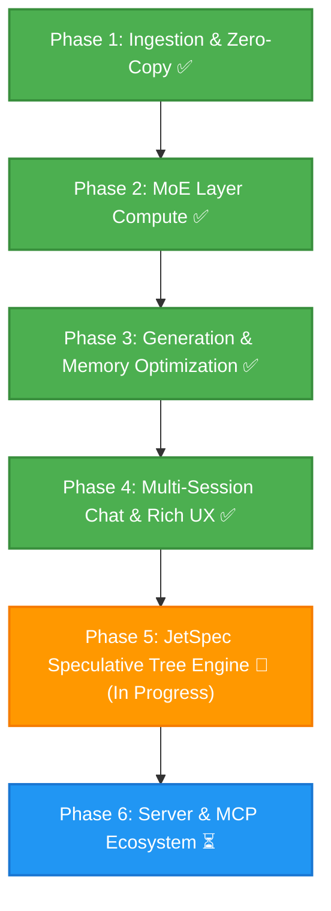

# DynaMoE

*Dynamic, SSD-Streamed Mixture-of-Experts, Hybrid Attention, and JetSpec-Accelerated LLM Inference on Apple Silicon.*

DynaMoE is a high-performance native macOS application, local inference engine, Model Context Protocol (MCP) server, and OpenAI-compatible API host. Engineered specifically for Apple Silicon's Unified Memory Architecture (UMA), DynaMoE runs massive Mixture-of-Experts (MoE), cutting-edge hybrid attention architectures (Qwen 3.8 Flash Next), and dense language models that exceed physical system RAM by dynamically memory-mapping and streaming weights directly from high-speed NVMe storage to the GPU.

---

## Inspiration & Acknowledgements

This project was undertaken purely for the joy of exploration by someone who is not a software engineer or even a "real" developer. Just someone who is enjoying learning with the help of AI. I'm steering the ship, and Gemini 3.6 and 3.7 are largely implementing the ideas and pointing me in the right direction.

Special thanks and acknowledgement to the open-source projects and research that inspired and influenced this architecture:
* **JetSpec** (Hao AI Lab / UC San Diego — [arXiv:2606.18394](https://arxiv.org/html/2606.18394v2)): Causal parallel tree drafting and tree-causal attention verification for breakthrough speculative decoding throughput.
* **Flash-MoE** (https://github.com/danveloper/flash-moe) by Dan Woods: Pioneering work on MoE expert repackaging format and contiguous binary layer storage layout (`packed_experts/layer_XX.bin`). DynaMoE builds upon Flash-MoE's expert restructuring concepts to enable high-throughput asynchronous POSIX `pread` file streaming directly into shared Metal GPU buffers.
* **Colibri** (https://github.com/JustVugg/colibri): Pioneering work on high-speed off-disk model execution.

---

## Supported Architectures & Models

DynaMoE supports sparse Mixture-of-Experts, hybrid recurrent SSM/attention architectures, and dense autoregressive transformers with automatic model topology detection.

**Note:** Qwen 3.8 Flash Next and Ornith 1.5 9B will be the first fully supported models. Neither are currently functioning properly, but will be working soon, so try at your own risk right now 😆

| Model / Family | Parameters | Active Parameters | Architecture Type | Quantization & Precision | Context Window |
| :--- | :--- | :--- | :--- | :--- | :--- |
| **Qwen 3.8 Flash Next** | ~180B (512 Experts + 51B PLE) | ~6B (10 Active + Shared) | Hybrid GatedDeltaNet + QSA Sparse Attention + Gated Residuals | FP8 (MXFP8) / BF16 / NVFP4 | 131,072 / 262,144 |
| **Ornith 1.5 35B A3B** | 35B (256 Experts) | ~3B (8 Active + Shared) | Hybrid GatedDeltaNet + GQA | Q4 Affine / Q8 / BF16 / FP8 (MXFP8) | 262,144 (Native) / 1M+ (YaRN) |
| **Ornith 1.5 9B Dense** | 9B Dense | 9B | Hybrid GatedDeltaNet + GQA | 8-Bit Affine / BF16 / FP16 | 131,072 |
| **Standard Dense LLMs** | 3B – 32B | Full Layer Width | Dense Transformer (LLaMA / Qwen 2.5 / Nanbeige) | Q4 / Q8 / BF16 / FP16 | Model Default |

### Key Architectural Strengths:
* **Hybrid Recurrent SSM + Sparse/Full Attention**: GatedDeltaNet linear recurrent attention layers ($O(1)$ constant-memory recurrent state updates) interleaved 3:1 with Qwen Sparse Attention (QSA) or Grouped-Query Attention (GQA).
* **Massive Fine-Grained Sparsity & High-Throughput Routing**: 256–512 routed experts per layer (Top-8 / Top-10 activated per token) plus dedicated Sigmoid-gated shared experts with zero-copy NVMe streaming.
* **4-Stream Gated Residuals & N-Gram PLE Support**: 4 parallel structural residual streams with rank-320 bottleneck read/write gates and zero-copy Layer 2 N-gram Predictive Local Embedding (PLE) row gathering.
* **JetSpec Speculative Tree Acceleration**: Parallel candidate tree drafting with tree-causal attention masking and expert-aware MoE pruning.
* **Dynamic Architecture Auto-Detection**: Inspects `config.json`, SafeTensors headers, and tensor topologies to automatically configure layer count, hidden dimensions, attention heads, KV heads, RoPE theta, RMSNorm eps, unit offsets, and MLP projection types.

---

## 🚀 JetSpec Speculative Tree Acceleration

Speculative decoding traditionally forces a trade-off between the latency of sequential drafting (e.g. EAGLE) and the lower acceptance rates of independent block scoring (e.g. DFlash). **JetSpec** solves this by drafting an entire structured candidate tree in a single pass and verifying the tree nodes all at once using **tree-causal attention masking**.

```text
                         ┌─────────────────────────────┐
                         │   Root Token (Node 0)       │
                         └──────────────┬──────────────┘
                                        │
                       ┌────────────────┴────────────────┐
                       ▼                                 ▼
         ┌───────────────────────────┐     ┌───────────────────────────┐
         │ Candidate Branch A (Node 1│     │ Candidate Branch B (Node 2│
         └─────────────┬─────────────┘     └─────────────┬─────────────┘
                       │                                 │
                 ┌─────┴─────┐                     ┌─────┴─────┐
                 ▼           ▼                     ▼           ▼
             [Node 3]    [Node 4]              [Node 5]    [Node 6]
```

### Apple Silicon Unified Memory (UMA) Advantages
On Apple Silicon, JetSpec operates with zero host-to-device memory copy overhead. Candidate tree topology masks, parent-index tables, and multi-layer hidden states are updated directly in unified RAM and immediately accessible to Metal compute kernels.

### MoE Expert Expansion & Dynamic Pruning
When verifying $N$ candidate tree nodes simultaneously on an MoE model, each candidate node routes independently to its top-$K$ experts. The union of active experts $\mathcal{E}_l = \bigcup_{i \in \mathcal{T}} \text{TopK}(W_g \cdot h_{i,l})$ expands with tree width. DynaMoE incorporates an **expert-aware tree pruning engine** that prunes low-confidence branches when $|\mathcal{E}_l|$ exceeds the configured NVMe read bandwidth threshold ($E_{\text{max}}$), guaranteeing optimal speedups even during offloaded SSD streaming.

---

## Key Highlights & Capabilities

* **Zero-Copy Apple Silicon Unified Memory Bridge:** Memory-maps multi-gigabyte SafeTensors weight shards via `memmap2` in Rust and wraps raw memory addresses directly into Metal GPU buffers (`MTLBuffer(bytesNoCopy:length:options:deallocator:)` with `.storageModeShared`), eliminating redundant CPU-to-GPU copies.
* **SIMD-Coalesced Metal Compute Kernels:** Custom Metal Shading Language (MSL) compute shaders featuring SIMD-coalesced memory access and threadgroup shared memory caching for packed 4-bit/8-bit affine matrix-vector operations, FP8 (`E4M3`/`E5M2`) with block scales (MXFP8), SwiGLU expert projections (`gate_proj`, `up_proj`, `down_proj`), dynamic Top-8/Top-10 routing across up to 512 experts, and token embedding lookups.
* **FlashMoE Contiguous Expert Repackaging & Multi-Threaded Direct I/O:** Inspired by and adapted from Dan Woods' Flash-MoE project, DynaMoE supports restructuring sparse MoE model layers into contiguous per-layer expert binaries (`packed_experts/layer_XX.bin` + `layout.json`). A dedicated 8-thread background POSIX `pread` I/O pool (`ExpertIOThreadPool`) streams selected expert slices directly into shared Metal staging buffers, eliminating file fragmentation and maximizing NVMe read bandwidth during token generation.
* **Quantized FP8 & FP16 KV Cache:** Dynamically configurable KV cache precision (**FP32**, **FP16**, and **FP8 E4M3/E5M2**), reducing attention cache memory footprints by up to 75% and enabling long-context inference (32k+ tokens) on memory-constrained Macs.
* **Speculative MoE Expert Prefetching (`WorkingSetManager`):** Thread-safe background speculative lookahead prefetching pipeline using `posix_madvise(POSIX_MADV_WILLNEED)` to warm upcoming layer experts asynchronously before routing execution, alongside LRU page eviction (`POSIX_MADV_DONTNEED`) to keep RSS within strict hardware thresholds.
* **Hardware-Vectorized Accelerate Sampling:** Apple Accelerate framework integration using `vDSP_maxvi` for zero-overhead greedy sampling, $O(\log K)$ min-heap Top-$K$ candidate tracking, vectorized softmax normalization (`vvexpf`, `vDSP_vsmul`), and dynamic **Min-$P$** and **Top-$P$ (Nucleus)** probability truncation.
* **Universal Reasoning & `<think>` Accordion:** Automatic detection of reasoning/thinking models across Ornith, Qwen 2.5/3.5, DeepSeek-R1, Nanbeige, GLM, and Nemotron with dynamic inspection of `tokenizer_config.json` and `chat_template.jinja`. Renders real-time, collapsible chain-of-thought blocks with duration timers, char counts, and live streaming pace indicators.
* **Rich Markdown & Code Rendering Engine:** High-performance, debounced token streaming UI with full GitHub Flavored Markdown support, including tables with column alignment, blockquotes, callout alerts (`[!NOTE]`, `[!TIP]`, `[!IMPORTANT]`, `[!WARNING]`, `[!CAUTION]`), nested lists, and syntax-highlighted code blocks with one-click copy.
* **Hugging Face Local Cache Auto-Discovery:** Automatically scans `~/.cache/huggingface/hub` on launch to discover all downloaded models, snapshots, weight formats, and quantizations. Allows selecting an overall **Default Model** and automatically tracks the **Last Used Model**.
* **Antigravity-Style Multi-Session Chat UI:** Full multi-session chat workspace with persistent session history, creation, renaming, deletion, and an interactive in-chat dropdown model switcher to swap active models on the fly.
* **Model-Specific System Prompts & Conjunction Merging:** Built-in repository of required instruct personas (e.g. Nanbeige, Qwen, DeepSeek, Ornith). User-customized default system prompts in Settings are combined with model-required prompts *in conjunction* during inference.
* **Native macOS View Menu & Zoom Controls:** Top "View" menu options with standard keyboard shortcuts for **Actual Size** (`⌘0`), **Zoom In** (`⌘+`), and **Zoom Out** (`⌘-`) featuring proportional pixel-perfect geometry scaling.

---

## Architecture Overview

```text
DynaMoE/
├── DynaMoE/                 # Native macOS App (SwiftUI, Metal GPU Pipelines, Inference Engine)
│   ├── DynaMoEApp.swift     # Application entry point, View menu Zoom commands, and AppZoomManager
│   ├── ContentView.swift    # Core workspace coordinator, Metal compute dispatch, and autoregressive engine
│   ├── ChatDetailView.swift # Antigravity-style chat interface, markdown parser, thinking accordion, model switcher
│   ├── ChatModels.swift     # Multi-session chat models, message state, and persistence
│   ├── LocalModelManager.swift # Hugging Face cache scanner (~/.cache/huggingface/hub) and model registry
│   ├── ModelConfig.swift    # Config parser, architecture detection, and system prompt conjunction resolver
│   ├── SettingsSheetView.swift # Comprehensive Settings: Models, JetSpec Controls, Memory Modes, and Prompts
│   ├── SidebarView.swift    # Navigation sidebar for chat sessions, model info, and tensor catalog
│   ├── InferenceEngine.swift # GPU pipeline abstractions and compute shaders bridge
│   └── ComputeShaders.metal # MSL Kernels (Q4/Q8 GEMV, SIMD SwiGLU, MXFP8, DeltaNet, GQA, Tree-Causal Verification)
├── GeneratedFFI/            # Auto-Generated Swift UniFFI Bindings
│   ├── dynamoe_core.swift   # High-level Swift wrapper around Rust engine
│   └── dynamoe_coreFFI.*    # C headers & module maps
├── core/                    # High-Performance Rust Compute Core (`dynamoe-core`)
│   ├── Cargo.toml           # Engine dependencies (memmap2, safetensors, uniffi, tokenizers)
│   ├── src/lib.rs           # Multi-shard mmap engine, index parser, tensor catalog, generalized 3D slicing
│   └── src/jetspec.rs       # JetSpec candidate tree topology, causal masks, MoE pruner, acceptance oracles
└── README.md
```

---

## Project Roadmap & Status



### Phase 1: Foundation & Zero-Copy Ingestion ✅ *(Completed)*
- [x] Project architecture, licensing, and repository setup.
- [x] Automated Rust $\leftrightarrow$ Swift UniFFI compilation pipeline integrated into Xcode build phases.
- [x] Multi-shard SafeTensors index parser & Hugging Face cache snapshot/blob resolver.
- [x] Zero-copy `MTLBuffer` unified memory bridge passing page-cache addresses directly to Metal.
- [x] Fast Rust tokenizer integration (`tokenizers`) with live encoding/decoding playground.
- [x] Native Metal compute kernels for MXFP8, Q4, Q8, and BF16 embedding lookups.

### Phase 2: MoE Routing & Layer Compute ✅ *(Completed)*
- [x] **MoE Top-$K$ Gating Kernel (`mlp.gate.weight`)**: Metal shaders multiplying hidden states against router weights and extracting top-$K$ expert indices (supporting up to 512 fine-grained experts) with Softmax routing probabilities.
- [x] **SIMD-Coalesced Q4/Q8 Affine GEMV & SwiGLU**: Threadgroup-cached 4-bit/8-bit dequantization matrix-vector multiplication with SiLU activation and Hadamard product for expert projections (`gate_proj`, `up_proj`, `down_proj`).
- [x] **Shared Expert & Accumulation Pipeline**: Parallel GPU dispatch across active routed experts and Sigmoid-gated shared experts, accumulating into post-MLP hidden state vector $h_{\text{mlp}}$.
- [x] **Hybrid GatedDeltaNet SSM & GQA Attention**: Causal Conv1D, linear attention recurrent step, L2 head norm, per-head RMSNorm, partial RoPE, and fused GQA decode.
- [x] **4-Branch Gated Residual Blending**: Metal kernel performing read gating, write scaling, and accumulation across 4 structural streams.

### Phase 3: Generation, Sampling & Memory Optimization ✅ *(Completed)*
- [x] **Sequential Multi-Layer Backbone Engine ($h_0 \to h_N$)**: Double-buffered GPU layer loop chaining dynamic MoE routing, SwiGLU expert dispatch, RMSNorm, SSM DeltaNet, and GQA attention.
- [x] **Dense Transformer Engine**: Dedicated compute path supporting dense LLMs (e.g., Nanbeige, Ornith 9B, Qwen 2.5, LLaMA) with standard dense MLPs and RMSNorms.
- [x] **Quantized FP8 / FP16 KV Cache**: Configurable KV cache precision (FP32, FP16, FP8) with dedicated fused storage and attention decode kernels.
- [x] **Speculative MoE Expert Prefetching (`WorkingSetManager`)**: Asynchronous multi-layer lookahead prefetching (`POSIX_MADV_WILLNEED`) and LRU working set eviction (`POSIX_MADV_DONTNEED`).
- [x] **Hardware-Vectorized Accelerate Sampling**: Apple Accelerate (`vDSP_maxvi`, `vvexpf`) greedy and min-heap Top-$K$ sampling, adaptive **Min-$P$**, and **Top-$P$ (Nucleus)** truncation.

### Phase 4: Multi-Session Chat & User Experience ✅ *(Completed)*
- [x] **Hugging Face Cache Auto-Discovery**: Automatic discovery of local models in `~/.cache/huggingface/hub` with size computation and model registry.
- [x] **Multi-Session Chat Workspace**: Antigravity-style session history, creation, renaming, and persistent session state.
- [x] **In-Chat Model Switcher**: Fast dropdown menu below chat input to switch active models with automatic session retention.
- [x] **Universal Thinking / `<think>` Visualization**: Expandable/collapsible reasoning view with live token count, duration timers, streaming pace indicators, and toggleable reasoning prefill.
- [x] **Rich Markdown & Code Block Engine**: Full GitHub Flavored Markdown renderer with table support, callout alerts, blockquotes, and syntax-highlighted code blocks with one-click copying.
- [x] **Model-Specific System Prompts & Conjunction Merging**: Automatic injection of mandatory instruct prompts combined with user-saved default system prompts.
- [x] **Native macOS View Menu Zoom**: Zoom In (`⌘+`), Zoom Out (`⌘-`), and Actual Size (`⌘0`) with proportional geometry scaling.

---

### Phase 5: JetSpec Speculative Tree Acceleration 🚀 *(In Active Implementation)*

#### What Has Been Completed to Date:
- [x] **Rust Core Tree Topology Engine (`core/src/jetspec.rs`)**:
  - `DraftTreeTopology` representation building flattened candidate trees from draft tokens and confidence scores.
  - Flattened $N \times N$ tree-causal attention mask generator (`generate_tree_mask`) with ancestor traversal.
  - Dynamic MoE expert budget pruner (`prune_for_expert_budget`) protecting NVMe bandwidth.
  - Greedy argmax (`verify_greedy`) and stochastic speculative sampling (`verify_speculative_sampling`) verification oracles with bonus token generation.
  - UniFFI bridge bindings exposing tree construction, pruning, and verification functions to Swift.
- [x] **Metal Shading Language (MSL) Tree Kernels (`ComputeShaders.metal`)**:
  - `jet_draft_head_predict_bf16`: Projects multi-layer hidden states through the draft head.
  - `gqa_attention_tree_verify_standard` & `gqa_attention_tree_verify_standard_f16`: FP32/FP16 tree-causal grouped-query attention verification.
  - `gqa_attention_tree_verify_fused` & `gqa_attention_tree_verify_fused_f16`: Gated-Q tree-causal verification with sigmoid output gating.
  - `gdn_linear_attention_tree_step`: Gated DeltaNet state branching along candidate trees.
- [x] **Engine Staging Buffers & UI Controls (`InferenceEngine.swift`, `ContentView.swift`, `SettingsSheetView.swift`)**:
  - `JetSpecStagingBuffers` struct managing shared Metal buffers for candidate tokens, masks, logits, and hidden states.
  - Settings UI controls for JetSpec toggle, tree depth ($D$), branching factor ($B$), and max active expert cap ($E_{\text{max}}$).
  - Real-time generation status badges reporting mean accepted tokens per round ($\tau$), draft acceptance count, and speedup metrics.

#### Slated to Finalize the JetSpec Project:
- [ ] **Multi-Node Target Model Parallel Forward Pass (`runJetSpecTreeForward`)**:
  - Implement simultaneous forward evaluation of all $N$ candidate tree nodes through the full transformer backbone in a single parallel GPU pass.
  - Replace single-root forward execution in `runJetSpecTreeStep` with batched tree-causal attention and MoE dispatch.
- [ ] **Speculative KV Cache Placement, Commit & Rollback**:
  - Direct candidate tree nodes to write key-value pairs into speculative KV slots (`prefixLen .. prefixLen + N`).
  - Automatically compact accepted branch KV entries into the permanent cache sequence and rollback/discard unaccepted branch slots.
- [ ] **Parallel Causal Draft Head Proposal Pipeline**:
  - Connect live multi-layer hidden states to `jet_draft_head_predict_bf16` (or top-$k$ beam expansion for models without dedicated draft heads) to generate the candidate token tree.
- [ ] **Real Router Lookahead for MoE SSD Expert Prefetching**:
  - Replace placeholder random expert selection with actual router gate evaluation ($W_{\text{gate}} \cdot h_i$) across candidate nodes, pruning branches to respect the NVMe streaming budget before issuing `posix_madvise(POSIX_MADV_WILLNEED)`.
- [ ] **Dual-Phase Performance Benchmarking & Validation**:
  - **Phase 1 (Dense Validation)**: Benchmark Ornith 1.5 9B Dense (100% RAM resident) to isolate and verify pure GPU compute acceleration ($5\times - 9\times$).
  - **Phase 2 (MoE Validation)**: Benchmark Qwen 3.8 Flash Next under SSD streaming with dynamic tree pruning.

---

### Phase 6: Local Server & Ecosystem Integration ⏳ *(Upcoming)*
- [ ] Embedded OpenAI-compatible HTTP server (`/v1/chat/completions`, `/v1/models`).
- [ ] Native Model Context Protocol (MCP) server for local tool execution and agent integration.
- [ ] Configurable YaRN RoPE scaling UI toggle for long-context execution up to 1M tokens.
- [ ] Real-time SSD read bandwidth, GPU compute utilization, and memory pressure diagnostics.

---

## Getting Started

### Prerequisites
* macOS 14.0+ (Sonoma or Sequoia recommended)
* Apple Silicon Mac (M1/M2/M3/M4/M5/M6, 16 GB+ Unified Memory recommended)
* Xcode 15.0+ with Command Line Tools
* Rust toolchain (`curl --proto '=https' --tlsv1.2 -sSf https://sh.rustup.rs | sh`)

### Building and Running
1. Clone the repository:
   ```bash
   git clone https://github.com/derekrparris/DynaMoE.git
   cd DynaMoE
   ```
2. Build the Rust core and generate UniFFI bindings:
   ```bash
   cd core
   cargo build --release
   cargo run --bin uniffi-bindgen generate --library target/release/libdynamoe_core.dylib --language swift --out-dir ../GeneratedFFI
   cd ..
   ```
3. Open `DynaMoE/DynaMoE.xcodeproj` in Xcode.
4. Press **Cmd + R** to build and launch DynaMoE.
5. On startup, DynaMoE automatically scans your `~/.cache/huggingface/hub` directory for downloaded models. Open **Settings (⌘,) $\to$ Models** to select your default model, or select any discovered model directly from the chat dropdown!

---

## License

Distributed under the Apache License, Version 2.0. See [`LICENSE`](LICENSE) and [`THIRD_PARTY_LICENSES.md`](THIRD_PARTY_LICENSES.md) for details.

