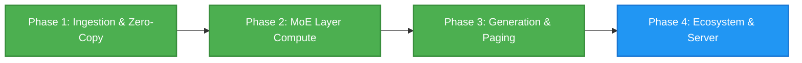

# DynaMoE

*Dynamic, SSD-streamed Mixture-of-Experts LLM inference on Apple Silicon.*

DynaMoE is a high-performance native macOS application, local inference engine, Model Context Protocol (MCP) server, and OpenAI-compatible API host. Engineered specifically for Apple Silicon's Unified Memory Architecture, DynaMoE runs massive Mixture-of-Experts (MoE) language models that exceed physical system RAM by dynamically memory-mapping and streaming expert weights directly from high-speed NVMe storage to the GPU.

---

## Inspiration

This project was undertaken purely for the joy of exploration by someone who is not a software engineer or even a "real" developer. Just someone who is enjoying learning with the help of AI. I'm steering the ship, and Gemini 3.6 and 3.7 are largely implementing the ideas and pointing me in the right direction.

The projects that originally inspired this exploration were:
* **Colibri** https://github.com/JustVugg/colibri
* **Flash-MoE** https://github.com/danveloper/flash-moe

---

## Supported & Curated Models

DynaMoE is tailored for state-of-the-art sparse Mixture-of-Experts architectures. The **first family of curated models** supported is the **Qwen MoE family** (including hybrid SSM-Attention architectures). 

The initial curated flagship models supported out-of-the-box are:

| Model | Parameters | Active Parameters | Architecture | Quantization | Context Window |
| :--- | :--- | :--- | :--- | :--- | :--- |
| **Ornith 1.5 35B** | 35B (256 Experts) | ~3B (8 Active + Shared) | Hybrid GatedDeltaNet + GQA | Q4 Affine / Q8 / BF16 | 262,144 (Native) / 1M+ (YaRN) |
| **Qwen 3.5 35B MoE** | 35B (256 Experts) | ~3B (8 Active + Shared) | Hybrid GatedDeltaNet + GQA | Q4 Affine / Q8 / BF16 | 262,144 (Native) / 1M+ (YaRN) |

### Key Architectural Strengths:
* **Hybrid GatedDeltaNet SSM + Full Attention**: 30 linear attention layers with $O(1)$ constant-memory recurrent state plus 10 full Grouped-Query Attention (GQA) layers with partial rotary position embeddings (RoPE).
* **Massive Native Context (256k to 1M+)**: Out-of-the-box support for 262,144 token context windows with near-zero memory growth during linear attention layers, and frequency-scaling (YaRN) support for extending context beyond 1 million tokens.
* **Granular Sparsity**: 256 fine-grained routed experts per layer (Top-8 activated per token) plus a dedicated Sigmoid-gated shared expert.

---

## Key Highlights & Capabilities

* **Zero-Copy Apple Silicon Unified Memory Bridge:** Memory-maps multi-gigabyte SafeTensors weight shards via `memmap2` in Rust and wraps raw memory addresses directly into Metal GPU buffers (`MTLBuffer(bytesNoCopy:length:options:deallocator:)` with `.storageModeShared`), eliminating redundant CPU-to-GPU copies.
* **4-Bit / 8-Bit Affine Metal Compute Kernels (Q4 / Q8):** Custom Metal Shading Language (MSL) compute shaders for packed 4-bit affine matrix-vector operations, SwiGLU expert feed-forward networks (`gate_proj`, `up_proj`, `down_proj`), dynamic Top-8 routing, and token embedding lookup with group-wise BF16/FP16 scales and biases.
* **Hardware-Aware Unaligned Memory Subsystem:** Custom unaligned byte-load helpers (`read_u16_unaligned`, `read_bf16_unaligned`, `read_u32_unaligned`) designed specifically for Apple Silicon GPUs, avoiding typed pointer truncation across irregular SafeTensors shard headers.
* **Recurrent Linear State & GQA Attention Pipeline:** Complete GPU-accelerated GatedDeltaNet recurrent linear attention with causal 1D convolution (`causal_conv1d_silu`), RMS head norm, and fused GQA autoregressive decoding with dynamic KV caching.
* **RAM-Constrained SSD Expert Paging (`WorkingSetManager`):** Dynamic active-expert LRU working set manager with `madvise` / `posix_madvise` demand paging and prefetching, allowing 35B+ parameter models to execute smoothly on 16 GB Apple Silicon Macs.
* **Multi-Shard SafeTensors & Hugging Face Cache Resolver:** Seamlessly loads single-shard and multi-shard models from `model.safetensors.index.json`, automatically traversing Hugging Face `snapshots/` and `blobs/` symlinks to assemble complete model topologies.
* **Rust Tokenization Pipeline:** Integrated Hugging Face `tokenizers` library exposed through automated UniFFI Swift bindings for sub-millisecond token encoding and decoding.
* **Interactive SwiftUI Architecture Dashboard:** Live inspection of model topologies, per-layer routed expert statistics, memory footprint breakdown, and interactive streaming chat interface.
* **Open & Modular:** Released under the permissive **Apache 2.0** license for open research and community collaboration.

---

## Architecture Overview

```text
DynaMoE/
├── DynaMoE/                 # Native macOS App (SwiftUI, Metal GPU Pipelines, Inference Engine)
│   ├── ContentView.swift    # Interactive Model Topology, WorkingSetManager & Generation Engine
│   ├── ComputeShaders.metal # MSL Kernels (Q4/Q8 Affine GEMV, SwiGLU, DeltaNet, GQA, RoPE, RMSNorm)
│   └── DynaMoEApp.swift     # Application Entry Point & Native macOS Open Dialogs
├── GeneratedFFI/            # Auto-Generated Swift UniFFI Bindings
│   ├── dynamoe_core.swift   # High-level Swift wrapper around Rust engine
│   └── dynamoe_coreFFI.*    # C headers & module maps
├── core/                    # High-Performance Rust Compute Core (`dynamoe-core`)
│   ├── Cargo.toml           # Engine dependencies (memmap2, safetensors, uniffi, tokenizers)
│   └── src/lib.rs           # Multi-shard mmap engine, index parser, tensor catalog
└── README.md
```

### Technology Stack
* **Frontend UI & Orchestration:** SwiftUI, Swift 6.0+, AppKit
* **Compute Engine (Rust):** `dynamoe-core`, `safetensors`, `memmap2`, `tokenizers`, `serde_json`, `uniffi`
* **GPU Compute (Metal):** Metal Shading Language (MSL), Metal Performance Shaders
* **Interoperability:** Zero-overhead UniFFI FFI bindings compiled automatically via Xcode build phases

---

## Project Roadmap



### Phase 1: Foundation & Zero-Copy Ingestion ✅ *(Completed)*
- [x] Project architecture, licensing, and repository setup.
- [x] Automated Rust $\leftrightarrow$ Swift UniFFI compilation pipeline integrated into Xcode.
- [x] Multi-shard SafeTensors index parser & Hugging Face cache snapshot/blob resolver.
- [x] Zero-copy `MTLBuffer` unified memory bridge passing page-cache addresses directly to Metal.
- [x] Fast Rust tokenizer integration (`tokenizers`) with live encoding/decoding playground.
- [x] Native Metal compute kernels for MXFP8, Q4, and BF16 embedding lookup ($h_0$).
- [x] Interactive SwiftUI dashboard for layer inspection, expert distribution, and live GPU kernel execution.

### Phase 2: MoE Routing & Layer Compute ✅ *(Completed)*
- [x] **MoE Top-$K$ Gating Kernel (`mlp.gate.weight`)**: Metal shaders multiplying hidden states against Q4/Q8/FP8 router weights, applying Softmax, and extracting top-8 expert indices with routing probabilities.
- [x] **Q4 Affine GEMV & SwiGLU MLP**: High-performance 4-bit affine dequantization matrix-vector multiplication with SiLU activation and Hadamard product for expert projections (`gate_proj`, `up_proj`, `down_proj`).
- [x] **Shared Expert & Accumulation Pipeline**: Parallel GPU dispatch across top-8 active experts and Sigmoid-gated shared expert, weighted accumulation into post-MLP hidden state vector $h_{\text{mlp}}$.
- [x] **Hybrid GatedDeltaNet SSM & GQA Attention**: Causal Conv1D, linear attention recurrent step, L2 head norm, per-head RMSNorm, partial RoPE, and fused GQA decode.
- [x] **Hardware-Aware Unaligned Memory Loading**: Robust unaligned byte reading in Metal shaders to support arbitrary SafeTensors header offsets.

### Phase 3: Multi-Layer Execution & Autoregressive Generation ✅ *(Completed)*
- [x] **Sequential Multi-Layer Backbone Engine ($h_0 \to h_{40}$)**: Double-buffered GPU layer loop chaining dynamic Top-8 MoE routing, SwiGLU expert dispatch, RMSNorm, SSM DeltaNet, and GQA attention across all 40 layers.
- [x] **Final RMSNorm & LM Head Vocabulary Projection**: Pre-norm layer and GPU vocabulary projection ($2048 \to 248,320$) generating full vocabulary logits and live top candidate token decoding.
- [x] **Autoregressive Generation & Sampling Loop**: Interactive streaming token generation engine supporting Temperature, Top-$P$ (Nucleus), Top-$K$, Repetition Penalties, and live tok/s telemetry in SwiftUI.
- [x] **Dynamic SSD Expert Paging (`WorkingSetManager`)**: Active-expert LRU working set manager with `madvise` demand paging and prefetching for memory-constrained Apple Silicon devices.

### Phase 4: Local Server & Ecosystem Integration 🚀 *(In Progress)*
- [ ] Embedded OpenAI-compatible HTTP server (`/v1/chat/completions`, `/v1/models`).
- [ ] Native Model Context Protocol (MCP) server for local tool execution and agent integration.
- [ ] Configurable YaRN RoPE scaling UI toggle for long-context execution up to 1M tokens.
- [ ] Real-time SSD read bandwidth, GPU compute utilization, and memory pressure diagnostics.

---

## Getting Started

### Prerequisites
* macOS 14.0+ (Sonoma or Sequoia recommended)
* Apple Silicon Mac (M1/M2/M3/M4, 16 GB+ Unified Memory recommended)
* Xcode 15.0+ with Command Line Tools
* Rust toolchain (`curl --proto '=https' --tlsv1.2 -sSf https://sh.rustup.rs | sh`)

### Building and Running
1. Clone the repository:
   ```bash
   git clone https://github.com/derekrparris/DynaMoE.git
   cd DynaMoE
   ```
2. Build the Rust core and generate UniFFI bindings:
   ```bash
   cd core
   cargo build
   cargo run --bin uniffi-bindgen generate --library target/debug/libdynamoe_core.dylib --language swift --out-dir ../GeneratedFFI
   cd ..
   ```
3. Open `DynaMoE/DynaMoE.xcodeproj` in Xcode.
4. Press **Cmd + R** to build and launch DynaMoE.
5. Click **"Load tokenizer.json"** to select your model's tokenizer, then click **"Select Model Folder / Index"** to load your SafeTensors model folder or `model.safetensors.index.json` (e.g. Ornith 1.5 35B or Qwen 3.5 35B).

---

## License

Distributed under the Apache License, Version 2.0. See [`LICENSE`](LICENSE) and [`THIRD_PARTY_LICENSES.md`](THIRD_PARTY_LICENSES.md) for details.
