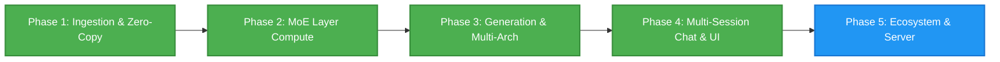

# DynaMoE

*Dynamic, SSD-Streamed Mixture-of-Experts and Dense LLM Inference on Apple Silicon.*

DynaMoE is a high-performance native macOS application, local inference engine, Model Context Protocol (MCP) server, and OpenAI-compatible API host. Engineered specifically for Apple Silicon's Unified Memory Architecture, DynaMoE runs massive Mixture-of-Experts (MoE) and Dense language models that exceed physical system RAM by dynamically memory-mapping and streaming weights directly from high-speed NVMe storage to the GPU.

---

## Inspiration

This project was undertaken purely for the joy of exploration by someone who is not a software engineer or even a "real" developer. Just someone who is enjoying learning with the help of AI. I'm steering the ship, and Gemini 3.6 and 3.7 are largely implementing the ideas and pointing me in the right direction.

The projects that originally inspired this exploration were:
* **Colibri** https://github.com/JustVugg/colibri
* **Flash-MoE** https://github.com/danveloper/flash-moe

---

## Supported Architectures & Models

DynaMoE supports both sparse Mixture-of-Experts and dense autoregressive transformer architectures with automatic model topology detection.

| Model / Family | Parameters | Active Parameters | Architecture Type | Quantization & Precision | Context Window |
| :--- | :--- | :--- | :--- | :--- | :--- |
| **Ornith 1.5 35B** | 35B (256 Experts) | ~3B (8 Active + Shared) | Hybrid GatedDeltaNet + GQA | Q4 Affine / Q8 / BF16 / FP8 | 262,144 (Native) / 1M+ (YaRN) |
| **Qwen 3.5 35B MoE** | 35B (256 Experts) | ~3B (8 Active + Shared) | Hybrid GatedDeltaNet + GQA | Q4 Affine / Q8 / BF16 / FP8 | 262,144 (Native) / 1M+ (YaRN) |
| **Nanbeige 4.2 3B** | 3B Dense | 3B | Dense Transformer (22 Layers) | FP8 (E4M3) / BF16 / FP16 | 32,768 |
| **Qwen 2.5 / DeepSeek / LLaMA** | 0.5B – 70B+ | All / Active | Dense & Sparse MoE | Q4 / Q8 / FP8 / BF16 / FP16 | Up to 128,000+ |

### Key Architectural Strengths:
* **Hybrid GatedDeltaNet SSM + Full Attention**: 30 linear attention layers with $O(1)$ constant-memory recurrent state plus 10 full Grouped-Query Attention (GQA) layers with partial rotary position embeddings (RoPE).
* **Dense Transformer Acceleration**: Dedicated compute pipelines for standard dense MLP architectures, non-offset RMSNorms, and 22–32 layer dense configurations.
* **Granular Sparsity**: 256 fine-grained routed experts per layer (Top-8 activated per token) plus dedicated Sigmoid-gated shared experts.
* **Dynamic Architecture Auto-Detection**: Inspects `config.json` and tensor topologies to automatically configure layer count, hidden dimensions, attention heads, KV heads, RoPE theta, RMSNorm eps, unit offsets, and MLP projection types.

---

## Key Highlights & Capabilities

* **Zero-Copy Apple Silicon Unified Memory Bridge:** Memory-maps multi-gigabyte SafeTensors weight shards via `memmap2` in Rust and wraps raw memory addresses directly into Metal GPU buffers (`MTLBuffer(bytesNoCopy:length:options:deallocator:)` with `.storageModeShared`), eliminating redundant CPU-to-GPU copies.
* **4-Bit / 8-Bit Affine & FP8 Metal Compute Kernels:** Custom Metal Shading Language (MSL) compute shaders for packed 4-bit/8-bit affine matrix-vector operations, FP8 (`E4M3`/`E5M2`) with tensor scaling, SwiGLU expert feed-forward networks (`gate_proj`, `up_proj`, `down_proj`), dynamic Top-8 routing, and token embedding lookup with group-wise BF16/FP16 scales and biases.
* **Hugging Face Local Cache Auto-Discovery:** Automatically scans `~/.cache/huggingface/hub` on launch to discover all downloaded models, snapshots, weight formats, and quantizations. Allows selecting an overall **Default Model** and automatically tracks the **Last Used Model**.
* **Antigravity-Style Multi-Session Chat UI:** Full multi-session chat workspace with session history, creation, renaming, and deletion. Features an interactive in-chat dropdown model switcher to swap active models on the fly.
* **Reasoning / `<think>` Stream Visualization:** Collapsible thinking blocks that display real-time chain-of-thought reasoning with token counts, live tokens/sec metrics, and animated status indicators.
* **Model-Specific Required System Prompts & Conjunction Merging:** Built-in repository of required instruct personas (e.g. Nanbeige, Qwen, DeepSeek). User-customized default system prompts in Settings are combined with model-required prompts *in conjunction* during inference.
* **Up to 10,000 Max Output Tokens & Dynamic KV Cache:** Configurable max output token limit up to 10,000 tokens with quick presets (`512`, `1024`, `2048`, `4096`, `8192`, `10000`) and dynamic Metal KV cache buffer allocation (up to 32k context) to prevent memory overflows.
* **RAM-Constrained SSD Expert Paging (`WorkingSetManager`):** Dynamic active-expert LRU working set manager with `madvise` / `posix_madvise` demand paging and prefetching, allowing 35B+ parameter models to execute smoothly on 16 GB Apple Silicon Macs.
* **Native macOS View Menu & Zoom Controls:** Top "View" menu options with standard keyboard shortcuts for **Actual Size** (`⌘0`), **Zoom In** (`⌘+`), and **Zoom Out** (`⌘-`) featuring proportional pixel-perfect geometry scaling.
* **Rust Tokenization Pipeline:** Integrated Hugging Face `tokenizers` library exposed through automated UniFFI Swift bindings for sub-millisecond token encoding and decoding.

---

## Architecture Overview

```text
DynaMoE/
├── DynaMoE/                 # Native macOS App (SwiftUI, Metal GPU Pipelines, Inference Engine)
│   ├── DynaMoEApp.swift     # Application entry point, View menu Zoom commands, and AppZoomManager
│   ├── ContentView.swift    # Core workspace coordinator, Metal compute dispatch, and autoregressive engine
│   ├── ChatDetailView.swift # Antigravity-style chat interface, thinking blocks, and in-chat model switcher
│   ├── ChatModels.swift     # Multi-session chat models, message state, and persistence
│   ├── LocalModelManager.swift # Hugging Face cache scanner (~/.cache/huggingface/hub) and model registry
│   ├── ModelConfig.swift    # Config parser, architecture detection, and system prompt conjunction resolver
│   ├── SettingsSheetView.swift # Comprehensive Settings: Models, Generation, Memory Modes, and Prompts
│   ├── SidebarView.swift    # Navigation sidebar for chat sessions, model info, and tensor catalog
│   ├── InferenceEngine.swift # GPU pipeline abstractions and compute shaders bridge
│   └── ComputeShaders.metal # MSL Kernels (Q4/Q8 Affine GEMV, FP8, SwiGLU, DeltaNet, GQA, RoPE, RMSNorm)
├── GeneratedFFI/            # Auto-Generated Swift UniFFI Bindings
│   ├── dynamoe_core.swift   # High-level Swift wrapper around Rust engine
│   └── dynamoe_coreFFI.*    # C headers & module maps
├── core/                    # High-Performance Rust Compute Core (`dynamoe-core`)
│   ├── Cargo.toml           # Engine dependencies (memmap2, safetensors, uniffi, tokenizers)
│   └── src/lib.rs           # Multi-shard mmap engine, index parser, tensor catalog
└── README.md
```

### Technology Stack
* **Frontend UI & Orchestration:** SwiftUI, Swift 6.0+, AppKit, Combine
* **Compute Engine (Rust):** `dynamoe-core`, `safetensors`, `memmap2`, `tokenizers`, `serde_json`, `uniffi`
* **GPU Compute (Metal):** Metal Shading Language (MSL), Metal Performance Shaders
* **Interoperability:** Zero-overhead UniFFI FFI bindings compiled automatically via Xcode build phases

---

## Project Roadmap



### Phase 1: Foundation & Zero-Copy Ingestion ✅ *(Completed)*
- [x] Project architecture, licensing, and repository setup.
- [x] Automated Rust $\leftrightarrow$ Swift UniFFI compilation pipeline integrated into Xcode.
- [x] Multi-shard SafeTensors index parser & Hugging Face cache snapshot/blob resolver.
- [x] Zero-copy `MTLBuffer` unified memory bridge passing page-cache addresses directly to Metal.
- [x] Fast Rust tokenizer integration (`tokenizers`) with live encoding/decoding playground.
- [x] Native Metal compute kernels for MXFP8, Q4, and BF16 embedding lookup ($h_0$).

### Phase 2: MoE Routing & Layer Compute ✅ *(Completed)*
- [x] **MoE Top-$K$ Gating Kernel (`mlp.gate.weight`)**: Metal shaders multiplying hidden states against Q4/Q8/FP8 router weights, applying Softmax, and extracting top-8 expert indices with routing probabilities.
- [x] **Q4 Affine GEMV & SwiGLU MLP**: High-performance 4-bit affine dequantization matrix-vector multiplication with SiLU activation and Hadamard product for expert projections (`gate_proj`, `up_proj`, `down_proj`).
- [x] **Shared Expert & Accumulation Pipeline**: Parallel GPU dispatch across top-8 active experts and Sigmoid-gated shared expert, weighted accumulation into post-MLP hidden state vector $h_{\text{mlp}}$.
- [x] **Hybrid GatedDeltaNet SSM & GQA Attention**: Causal Conv1D, linear attention recurrent step, L2 head norm, per-head RMSNorm, partial RoPE, and fused GQA decode.
- [x] **Hardware-Aware Unaligned Memory Loading**: Robust unaligned byte reading in Metal shaders to support arbitrary SafeTensors header offsets.

### Phase 3: Multi-Architecture & Autoregressive Engine ✅ *(Completed)*
- [x] **Sequential Multi-Layer Backbone Engine ($h_0 \to h_N$)**: Double-buffered GPU layer loop chaining dynamic Top-8 MoE routing, SwiGLU expert dispatch, RMSNorm, SSM DeltaNet, and GQA attention.
- [x] **Dense Transformer Engine**: Dedicated compute path supporting dense LLMs (e.g., Nanbeige 4.2 3B, Qwen 2.5, LLaMA) with standard dense MLPs and RMSNorms.
- [x] **Final RMSNorm & LM Head Vocabulary Projection**: Pre-norm layer and GPU vocabulary projection ($d \to V$) generating full vocabulary logits and live token decoding.
- [x] **Sampling Loop & Dynamic KV Cache**: Interactive streaming token generation engine supporting Temperature, Top-$P$ (Nucleus), Top-$K$, Repetition Penalties, and dynamic KV cache sizing up to 10,000 output tokens.
- [x] **Dynamic SSD Expert Paging (`WorkingSetManager`)**: Active-expert LRU working set manager with `madvise` demand paging and prefetching for memory-constrained Apple Silicon devices.

### Phase 4: Multi-Session Chat & User Experience ✅ *(Completed)*
- [x] **Hugging Face Cache Auto-Discovery**: Automatic discovery of local models in `~/.cache/huggingface/hub` with size computation and model registry.
- [x] **Multi-Session Chat Workspace**: Antigravity-style session history, creation, renaming, and persistent session state.
- [x] **In-Chat Model Switcher**: Fast dropdown menu below chat input to switch active models with automatic session retention.
- [x] **Thinking / `<think>` Visualization**: Expandable/collapsible reasoning view with live token count, streaming speed metrics, and animated status tags.
- [x] **Model-Specific System Prompts & Conjunction Merging**: Automatic injection of mandatory instruct prompts combined with user-saved default system prompts.
- [x] **Native macOS View Menu Zoom**: Zoom In (`⌘+`), Zoom Out (`⌘-`), and Actual Size (`⌘0`) with proportional geometry scaling.

### Phase 5: Local Server & Ecosystem Integration 🚀 *(In Progress)*
- [ ] Embedded OpenAI-compatible HTTP server (`/v1/chat/completions`, `/v1/models`).
- [ ] Native Model Context Protocol (MCP) server for local tool execution and agent integration.
- [ ] Configurable YaRN RoPE scaling UI toggle for long-context execution up to 1M tokens.
- [ ] Real-time SSD read bandwidth, GPU compute utilization, and memory pressure diagnostics.

---

## Getting Started

### Prerequisites
* macOS 14.0+ (Sonoma or Sequoia recommended)
* Apple Silicon Mac (M1/M2/M3/M4, 16 GB+ Unified Memory recommended)
* Xcode 15.0+ with Command Line Tools
* Rust toolchain (`curl --proto '=https' --tlsv1.2 -sSf https://sh.rustup.rs | sh`)

### Building and Running
1. Clone the repository:
   ```bash
   git clone https://github.com/derekrparris/DynaMoE.git
   cd DynaMoE
   ```
2. Build the Rust core and generate UniFFI bindings:
   ```bash
   cd core
   cargo build
   cargo run --bin uniffi-bindgen generate --library target/debug/libdynamoe_core.dylib --language swift --out-dir ../GeneratedFFI
   cd ..
   ```
3. Open `DynaMoE/DynaMoE.xcodeproj` in Xcode.
4. Press **Cmd + R** to build and launch DynaMoE.
5. On startup, DynaMoE automatically scans your `~/.cache/huggingface/hub` directory for downloaded models. Open **Settings (⌘,) $\to$ Models** to select your default model, or select any discovered model directly from the chat dropdown!

---

## License

Distributed under the Apache License, Version 2.0. See [`LICENSE`](LICENSE) and [`THIRD_PARTY_LICENSES.md`](THIRD_PARTY_LICENSES.md) for details.
