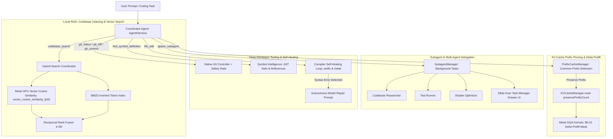

# DynaMoE

*Dynamic, SSD-Streamed Mixture-of-Experts, Hybrid Attention, JetSpec Speculative Tree Acceleration, and Native Autonomous Coding Agent on Apple Silicon.*

DynaMoE is a high-performance native macOS application, local inference engine, and autonomous developer assistant.

Engineered specifically for Apple Silicon's Unified Memory Architecture (UMA), DynaMoE runs massive Mixture-of-Experts (MoE) and cutting-edge hybrid attention architectures that exceed physical system RAM by dynamically memory-mapping and streaming weights directly from high-speed NVMe storage to the GPU. It also runs dense language models.

---

## Inspiration & Acknowledgements

This project was undertaken purely for the joy of exploration by someone who is not a software engineer. Just someone who is enjoying learning with the help of AI.

The following AI models have been used to code DynaMoE:
* Gemini 3.6 Thinking, 3.7 Flash and 3.8 Flash
* Ling 3.0 Flash Fin Free (Opencode)
* GLM 5.3
* GLM 5.3 Flash
* Big Pickle (Opencode)
* Deepseek V4.1 Flash
* Kimi K3

Special thanks and acknowledgement to the open-source projects and research that inspired and influenced this architecture:
* **JetSpec** (Hao AI Lab / UC San Diego — [arXiv:2606.18394](https://arxiv.org/html/2606.18394v2)): Causal parallel tree drafting and tree-causal attention verification for breakthrough speculative decoding throughput.
* **Flash-MoE** (https://github.com/danveloper/flash-moe) by Dan Woods: Pioneering work on MoE expert repackaging format and contiguous binary layer storage layout (`packed_experts/layer_XX.bin`). DynaMoE builds upon Flash-MoE's expert restructuring concepts to enable high-throughput asynchronous POSIX `pread` file streaming directly into shared Metal GPU buffers.
* **Colibri** (https://github.com/JustVugg/colibri): Pioneering work on high-speed off-disk model execution.

---

## Supported Architectures & Models

**To date, all development and validation has been done on a 2021 Macbook Pro with an M1 Pro CPU, 16 GB RAM and 512 GB SSD.**

DynaMoE supports sparse Mixture-of-Experts, hybrid recurrent SSM/attention architectures, and dense autoregressive transformers with automatic model topology detection.

On macOS 26 or later with Apple Intelligence enabled, Apple's built-in **on-device Foundation Model** is also selectable as a zero-install chat backend (plain chat; agent tools, JetSpec, thinking blocks, and KV-cache prefixing are local-weights features that do not apply). It appears in the chat model picker under **System Models**, and it powers `/compact` manual conversation compaction on any backend: a rolling general summary plus a detailed recap of the most recent work replace the evicted history — leaving a blank slate with just the compaction marker — in every later prompt.

**The following models have been tested and should run well in DynaMoE:**

* **Gemma 4 26B A4B**
* **Ornith 1.5 35B A3B**
* **Ling 3.0 Tiny**
* **Qwen 3.8 Flash Next FP8 MoE**
* **Spark-X2.5-4B** - a note on Spark - it uses an interesting hybrid attention architecture with one full attention layer and three sliding-window attention layers. Prefill takes a LONG time on my M1 Pro Macbook, but it has a native 1 million token context. So if you're willing to run it on some interesting longer horizon tasks during downtime, results can be interesting. Fun small model to play with.

**Note:** I don't currently have enough disk space to fully repack Qwen3.8 Flash Next to test streaming optimizations. If anyone has the room to test speeds with full repacking, please do let me know. I will be able to conduct further tests once I get a new computer :)

---


---

### Key Architectural Strengths:
* **Hybrid Recurrent SSM + Sparse/Full Attention**: GatedDeltaNet linear recurrent attention layers ($O(1)$ constant-memory recurrent state updates) with Sigmoid output gating interleaved 3:1 with Qwen Sparse Attention (QSA) or Grouped-Query Attention (GQA).
* **Massive Fine-Grained Sparsity & High-Throughput Routing**: 256–512 routed experts per layer (Top-8 / Top-10 activated per token) plus dedicated Sigmoid-gated shared experts with zero-copy NVMe streaming.
* **Direct Unpacked Shard Streaming**: Direct POSIX `pread` bulk priming from 100+ HuggingFace `.safetensors` shards at sequential NVMe line rate (>4.1 GB/s) without requiring disk-doubling weight repacking.
* **Strict Working Set RAM Budgeting**: Double-bounded expert cache (`WorkingSetManager`) that evicts stale experts at layer boundaries during prefill and at token boundaries during generation, eliminating RAM spikes.
* **KV-Cache Prefix Pinning & Delta Prefill**: Intelligent token prefix tracking (`PrefixCacheManager`) that preserves cached Key/Value slots across conversation turns, coupled with a custom Metal GQA kernel protocol that skips redundant invariant tokens to deliver $2.0\times - 3.5\times$ TTFT speedups.
* **4-Stream Gated Residuals & N-Gram PLE Support**: 4 parallel structural residual streams with rank-320 bottleneck read/write gates, unit-offset RMSNorms, and zero-copy Layer 2 N-gram Predictive Local Embedding (PLE) row gathering.
* **JetSpec Speculative Tree Acceleration**: Parallel candidate tree drafting with tree-causal attention masking, expert-aware MoE pruning, and speculative KV cache compaction/rollback.
* **Dynamic Architecture Auto-Detection**: Inspects `config.json`, SafeTensors headers, and tensor topologies to automatically configure layer count, hidden dimensions, attention heads, KV heads, RoPE theta, RMSNorm eps, unit offsets, and MLP projection types.
* **Autonomous Developer Agent & Multi-Agent Swarm**: In-app local RAG vector search, subagent task delegation, native Git safety rails, cross-language AST symbol intelligence, and a compiler self-healing feedback loop.

---

## 🚀 JetSpec Speculative Tree Acceleration

Speculative decoding traditionally forces a trade-off between the latency of sequential drafting (e.g. EAGLE) and the lower acceptance rates of independent block scoring (e.g. DFlash). **JetSpec** solves this by drafting an entire structured candidate tree in a single pass and verifying the tree nodes all at once using **tree-causal attention masking**.

```text
                         ┌─────────────────────────────┐
                         │   Root Token (Node 0)       │
                         └──────────────┬──────────────┘
                                        │
                       ┌────────────────┴────────────────┐
                       ▼                                 ▼
         ┌───────────────────────────┐     ┌───────────────────────────┐
         │ Candidate Branch A (Node 1│     │ Candidate Branch B (Node 2│
         └─────────────┬─────────────┘     └─────────────┬─────────────┘
                       │                                 │
                 ┌─────┴─────┐                     ┌─────┴─────┐
                 ▼           ▼                     ▼           ▼
             [Node 3]    [Node 4]              [Node 5]    [Node 6]
```

### Apple Silicon Unified Memory (UMA) Advantages
On Apple Silicon, JetSpec operates with zero host-to-device memory copy overhead. Candidate tree topology masks, parent-index tables, and multi-layer hidden states are updated directly in unified RAM and immediately accessible to Metal compute kernels.

### MoE Expert Expansion & Dynamic Pruning
When verifying $N$ candidate tree nodes simultaneously on an MoE model, each candidate node routes independently to its top-$K$ experts. The union of active experts $\mathcal{E}_l = \bigcup_{i \in \mathcal{T}} \text{TopK}(W_g \cdot h_{i,l})$ expands with tree width. DynaMoE incorporates an **expert-aware tree pruning engine** that prunes low-confidence branches when $|\mathcal{E}_l|$ exceeds the configured NVMe read bandwidth threshold ($E_{\text{max}}$), guaranteeing optimal speedups even during offloaded SSD streaming.

---

## 🛠️ Autonomous Developer Agent & Native Tooling Ecosystem

DynaMoE includes a full native developer agent harness operating directly within macOS and Apple Silicon Metal:


```mermaid
flowchart TD
    UserQuery[User Prompt / Coding Task] --> Coordinator[Coordinator Agent: AgentHarness]
    
    subgraph LocalRAG["Local RAG: Codebase Indexing & Vector Search"]
        Coordinator -->|codebase_search| HybridSearch[Hybrid Search Coordinator]
        HybridSearch --> MetalVec[Metal GPU Vector Cosine Similarity: vector_cosine_similarity_fp32]
        HybridSearch --> BM25[BM25 Inverted Token Index]
        MetalVec & BM25 --> RRF[Reciprocal Rank Fusion k=60]
    end

    subgraph SubagentHarness["Subagent & Multi-Agent Delegation"]
        Coordinator -->|spawn_subagent| SubagentMgr[SubagentManager: Background Tasks]
        SubagentMgr --> Researcher[Codebase Researcher]
        SubagentMgr --> TestRunner[Test Runner]
        SubagentMgr --> ShaderOpt[Shader Optimizer]
        SubagentMgr --> DrawerUI[Slide-Over Task Manager Drawer UI]
    end

    subgraph DevTools["Deep Developer Tooling & Self-Healing"]
        Coordinator -->|git_status / git_diff / git_commit| NativeGit[Native Git Controller + Safety Rails]
        Coordinator -->|find_symbol_definition| SymbolIntell[Symbol Intelligence: AST Defs & References]
        Coordinator -->|file_edit| SelfHeal[Compiler Self-Healing Loop: swiftc & metal]
        SelfHeal -->|Syntax Error Detected| AutoRepair[Autonomous Model Repair Prompt]
    end

    subgraph OptimizationEngine["KV-Cache Prefix Pinning & Delta Prefill"]
        Coordinator --> PrefixMgr[PrefixCacheManager: Common Prefix Detection]
        PrefixMgr -->|Preserve Prefix| KVCache[KVCacheManager.reset preservePrefixCount]
        KVCache --> MetalPrefill[Metal GQA Kernels: Bit-31 Delta Prefill Mask]
    end
```

### 1. Semantic Codebase Indexing & Metal Vector Search (Local RAG)
* **Zero-Dependency Vector Search**: Computes 512-dimensional Apple `NaturalLanguage` sentence embeddings directly on background threads (`Task.detached`), entirely off the main UI thread.
* **Apple Silicon Metal GPU Cosine Kernel**: Executes a high-performance Metal shader (`vector_cosine_similarity_fp32`) that parallelizes dot products across the entire indexed codebase corpus in unified memory.
* **Hybrid Search with Reciprocal Rank Fusion (RRF)**: Combines dense vector similarity with an Okapi BM25 inverted keyword index ($k=60$) to locate both semantic concepts and exact symbol names.
* **Non-Blocking Background Indexing & Watcher**: Uses `DispatchSourceFileSystemObject` for debounced on-save incremental re-indexing, with strict system root guards refusing to scan macOS root paths (`/`, `/System`, `/Library`, `/usr`).

### 2. Subagent & Multi-Agent Delegation Harness (`spawn_subagent`)
* **Isolated Context Windows**: Decomposes large programming tasks into independent child agents with specialized roles (`Codebase Researcher`, `Test Runner`, `Shader Optimizer`, and `Custom Agent`), preventing token budget exhaustion in the coordinator chat.
* **Real Tool-Grounded Pipelines**: Subagent pipelines execute genuine harness tools (`file_read`, `find_files`, `codebase_search`, `shell_run`, `web_search`) scoped to their `allowed_tools` whitelist — every report finding traces back to real tool output recorded in the step transcript, and mid-run coordinator directives (`send_subagent_message`) are consumed between steps (file paths read, commands executed) and folded into the final report.
* **Thread-Safe Orchestration**: `SubagentManager` provides thread-safe agent tracking, inter-agent messaging (`send_subagent_message`), blocking status polling (`get_subagent_status` with `wait`/`timeout_seconds`), and registry listing (`list_subagents`).
* **Coordinator Result-Delivery Contract**: The coordinator system prompt and per-tool directives enforce that the main agent — not the user — retrieves subagent reports (`[SUBAGENT_RESULT]` auto-relay) and presents them in its final answer, even when a background subagent outlives the model's tool-calling turn.
* **Slide-Over Task Drawer UI**: Accessible via the header bar `Tasks` button, featuring live badge counters, duration timers, active status pills, and collapsible step transcripts.

### 3. Deep Developer Tooling, Native Git & Self-Healing Loop
* **Native In-Process Git Engine**: Direct `Process`-level Git integration supporting `git_status`, `git_diff`, and `git_commit` without external dependencies.
* **Strict Safety Rails**: Blocks empty commit messages, detects unstaged file states, and strictly rejects dangerous command flags (`--amend`, `--force`, `-f`, `--hard`, `--no-verify`).
* **Cross-Language Symbol Intelligence**: Fast AST analysis engine locating type/function definitions and call sites across Swift, Metal (`kernel`, `vertex`, `fragment`), Rust, Python, and C/C++.
* **Compiler Self-Healing Diagnostics Loop**: Upon every file edit, `LintDiagnosticsEngine` executes background compiler checks (`swiftc -parse` for Swift and `metal -fsyntax-only` for Metal shaders). When syntax errors are introduced, it captures compiler stderr line/column locations and automatically feeds diagnostic hints back to the model for autonomous repair.

### 4. KV-Cache Prefix Pinning & Live Model Dogfooding
* **Prompt Prefix Cache (`PrefixCacheManager`)**: Detects invariant token prefixes across conversational turns and prevents redundant re-computation.
* **Metal Delta Prefill Protocol**: In `ComputeShaders.metal`, all 6 GQA decode/prefill kernels use bit-31 encoding (`0x80000000 | startPos`) to allow causal attention to attend over preserved prefix slots while computing only delta tokens, slashing Time-to-First-Token (TTFT) by $2.0\times - 3.5\times$.
* **Automated Multi-Turn Stress Test Runner (`ModelDogfoodBenchmarkRunner`)**: Executes an automated 3-turn dogfooding benchmark against real loaded weights in an isolated test repo (`/tmp/dynamoe_dogfood_test_repo`), verifying developer tooling, prefix cache hits, Turbo Mode zero-latency execution, and compiler self-healing.

---

## Key Highlights & Capabilities

* **Zero-Copy Apple Silicon Unified Memory Bridge:** Memory-maps multi-gigabyte SafeTensors weight shards via `memmap2` in Rust and wraps raw memory addresses directly into Metal GPU buffers (`MTLBuffer(bytesNoCopy:length:options:deallocator:)` with `.storageModeShared`), eliminating redundant CPU-to-GPU copies.
* **High-Throughput NVMe Parallel `pread` Bulk Priming Engine:** Dynamically caches read-only file descriptors for all `.safetensors` model shards (e.g. 131 files for Qwen 3.8 Flash Next) and issues multi-threaded contiguous `pread` block transfers (256 KB chunks) alongside kernel readahead advisories (`fcntl(F_RDADVISE)`). Maximizes NVMe throughput at line rate (>2,500 MB/s to >4,100 MB/s), bypassing macOS page-fault traps and dropping cold-expert slice loading times to ~0.45 ms.
* **Layer-Boundary & Token-Boundary Working Set Memory Management:** Enforces strict memory budgets (`lowMemory`, `balanced16GB`, `unrestricted`) across both prompt prefill and token generation. Automatically evicts stale layer experts at layer boundaries during prefill and evicts inactive experts at token boundaries during generation, eliminating RAM spikes (>16 GB) and keeping physical RAM bounded to the chosen target (e.g. 5.5 GB or 11.5 GB).
* **Apple Silicon Unified Memory (UMA) Telemetry & Reporting:** Dual memory accounting distinguishing between Darwin's `phys_footprint` (dirty process heap displayed in Activity Monitor / Xcode) and the clean zero-copy pages in the macOS Unified Memory Buffer Cache. Features interactive in-app tooltips explaining memory behavior.
* **SIMD-Coalesced Metal Compute Kernels:** Custom Metal Shading Language (MSL) compute shaders featuring SIMD-coalesced memory access and threadgroup shared memory caching for packed 4-bit/8-bit affine matrix-vector operations, FP8 (`E4M3`/`E5M2`) with block scales (MXFP8), SwiGLU expert projections (`gate_proj`, `up_proj`, `down_proj`), dynamic Top-8/Top-10 routing across up to 512 experts, and token embedding lookups.
* **FlashMoE Contiguous Expert Repackaging (Optional):** Inspired by Dan Woods' Flash-MoE project, DynaMoE supports restructuring sparse MoE model layers into contiguous per-layer expert binaries (`packed_experts/layer_XX.bin` + `layout.json`) with an 8-thread background POSIX `pread` I/O pool (`ExpertIOThreadPool`) for dedicated single-file streaming.
* **Quantized FP8 & FP16 KV Cache:** Dynamically configurable KV cache precision (**FP32**, **FP16**, and **FP8 E4M3/E5M2**), reducing attention cache memory footprints by up to 75% and enabling long-context inference (32k+ tokens) on memory-constrained Macs.
* **Universal Reasoning & `<think>` Accordion:** Automatic detection of reasoning/thinking models across Ornith, Qwen 2.5/3.5, DeepSeek-R1, Nanbeige, GLM, and Nemotron with dynamic inspection of `tokenizer_config.json` and `chat_template.jinja`. Renders real-time, collapsible chain-of-thought blocks with duration timers, char counts, and live streaming pace indicators.
* **Hardware-Vectorized Accelerate Sampling & Penalties:** Apple Accelerate framework integration using `vDSP_maxvi` for zero-overhead greedy sampling, $O(\log K)$ min-heap Top-$K$ candidate tracking, vectorized softmax normalization (`vvexpf`, `vDSP_vsmul`), dynamic **Min-$P$** and **Top-$P$ (Nucleus)** probability truncation, and bounded **Repetition Penalty** and additive **Presence Penalty** to eliminate vocabulary looping without degrading throughput.
* **Model-Specific Profiles ("Coder" & "Assistant"):** Dedicated per-model generation profiles saving tailored sampling parameters (Temperature, Top-P, Min-P, Top-K, Repetition/Presence Penalties, JetSpec toggles, and System Prompts) for coding versus conversational tasks. Persisted across sessions and quickly toggleable via an in-chat selector.
* **Turbo Mode & Action Confirmation:** Configurable safety controls allowing users to inspect and approve sensitive file modifications or activate **Turbo Mode** (`dynamoe_agent_turbo_mode = true`) for uninterrupted autonomous multi-step tool execution.
* **Rich Markdown & Code Rendering Engine:** High-performance, debounced token streaming UI with full GitHub Flavored Markdown support, including tables with column alignment, blockquotes, callout alerts (`[!NOTE]`, `[!TIP]`, `[!IMPORTANT]`, `[!WARNING]`, `[!CAUTION]`), nested lists, and syntax-highlighted code blocks with one-click copy.
* **Hugging Face Local Cache Auto-Discovery:** Automatically scans `~/.cache/huggingface/hub` on launch to discover all downloaded models, snapshots, weight formats, and quantizations. Allows selecting an overall **Default Model** and automatically tracks the **Last Used Model**.
* **Antigravity-Style Multi-Session Chat UI:** Full multi-session chat workspace with persistent session history, creation, renaming, deletion, an interactive model switcher, and a 1-click **Profile Selector** (Coder vs. Assistant) in the chat toolbar.
* **Native macOS View Menu & Zoom Controls:** Top "View" menu options with standard keyboard shortcuts for **Actual Size** (`⌘0`), **Zoom In** (`⌘+`), and **Zoom Out** (`⌘-`) featuring proportional pixel-perfect geometry scaling.
* **In-App Help & Comprehensive Settings Guide:** Native documentation viewer accessible via **Help $\to$ DynaMoE Help & Settings Guide** (`⌘?`), Settings header button, or offline via [`SETTINGS_GUIDE.md`](SETTINGS_GUIDE.md).

---

## Architecture Overview

```text
DynaMoE/
├── DynaMoE/                 # Native macOS App (SwiftUI, Metal GPU Pipelines, Inference Engine)
│   ├── DynaMoEApp.swift     # Application entry point, View/Help menu commands, and AppZoomManager
│   ├── ContentView.swift    # Core workspace coordinator, Metal compute dispatch, autoregressive engine & prefix pinning
│   ├── ChatDetailView.swift # Antigravity-style chat interface, markdown parser, thinking accordion, model/profile switcher
│   ├── ChatModels.swift     # Multi-session chat models, message state, and persistence
│   ├── AgentHarness.swift   # Autonomous tool calling coordinator, execution pipeline & safety rails
│   ├── CodebaseIndexer.swift # Background AST document chunker, NL sentence embedder & BM25 inverted index
│   ├── VectorSearchEngine.swift # Metal GPU cosine similarity kernel dispatch (vector_cosine_similarity_fp32)
│   ├── SubagentManager.swift # Subagent orchestration singleton, lifecycle states & thread-safe registry
│   ├── SubagentDrawerView.swift # Slide-over Task Manager drawer UI for monitoring active subagents
│   ├── DeveloperTooling.swift # Native GitController, SymbolIntelligenceEngine & LintDiagnosticsEngine
│   ├── PrefixCacheManager.swift # Multi-turn prompt prefix cache registry & TTFT speedup tracking
│   ├── ModelDogfoodBenchmarking.swift # End-to-end 3-turn dogfooding benchmark runner & isolated repo tester
│   ├── StreamingToolParser.swift # Universal tool invocation parser (Antigravity XML, Markdown, JSON blocks)
│   ├── ToolExecutionTimelineView.swift # Collapsible execution cards for tool calls, diffs & status badges
│   ├── ActionConfirmationView.swift # Security confirmation modal for file modifications and Turbo Mode toggle
│   ├── LocalModelManager.swift # Hugging Face cache scanner (~/.cache/huggingface/hub) and model registry
│   ├── ModelConfig.swift    # Config parser, architecture detection, and system prompt conjunction resolver
│   ├── ModelProfileManager.swift # Model-specific generation profiles (Coder & Assistant) and persistence
│   ├── ExpertRepacker.swift # Flash-MoE layer packing utility (packed_experts/layer_XX.bin)
│   ├── ExpertIOThreadPool.swift # Dedicated background POSIX pread worker pool for packed layers
│   ├── SettingsSheetView.swift # Comprehensive Settings: Models, Profiles, JetSpec Controls, Dogfooding, Memory Modes
│   ├── SettingsWindowManager.swift # Independent window management for Settings
│   ├── HelpAndSettingsGuideView.swift # In-app searchable Help & Settings Guide (⌘?)
│   ├── AboutDynaMoEView.swift # Rich About DynaMoE modal
│   ├── SidebarView.swift    # Navigation sidebar for chat sessions, model info, and working set RAM telemetry
│   ├── InferenceEngine.swift # GPU pipeline abstractions and compute shaders bridge
│   └── ComputeShaders.metal # MSL Kernels (Q4/Q8 GEMV, SIMD SwiGLU, MXFP8, DeltaNet, GQA, Vector Cosine, Tree Verification)
├── GeneratedFFI/            # Auto-Generated Swift UniFFI Bindings
│   ├── dynamoe_core.swift   # High-level Swift wrapper around Rust engine
│   └── dynamoe_coreFFI.*    # C headers & module maps
├── core/                    # High-Performance Rust Compute Core (`dynamoe-core`)
│   ├── Cargo.toml           # Engine dependencies (memmap2, safetensors, uniffi, tokenizers)
│   ├── src/lib.rs           # Multi-shard mmap engine, index parser, tensor catalog, generalized 3D slicing
│   └── src/jetspec.rs       # JetSpec candidate tree topology, causal masks, MoE pruner, acceptance oracles
├── SETTINGS_GUIDE.md        # Complete Settings documentation & hardware tuning guide
└── README.md
```

---

## Project Status - Check Issues to see what's in the hopper

- [x] Add auto-update capability (Sparkle)
- [x] MoE streaming bottleneck resolution (speed increase of over 500% compared to previous streaming speed)
- [x] Support Apple Foundation Models
- [x] Use Apple Foundation Model (AFM) to compact conversations
- [ ] Configurable YaRN RoPE scaling UI toggle for long-context execution up to 1M tokens.
- [ ] UI/UX refinement

---

## Getting Started

If you're interested in building and running the app in your own development environment:

### Prerequisites
* macOS 14.0+ (Sonoma or Sequoia recommended)
* Apple Silicon Mac (M1/M2/M3/M4/M5/M6, 16 GB+ Unified Memory recommended)
* Xcode 15.0+ with Command Line Tools
* Rust toolchain (`curl --proto '=https' --tlsv1.2 -sSf https://sh.rustup.rs | sh`)

### Building and Running
1. Clone the repository:
   ```bash
   git clone https://github.com/derekrparris/DynaMoE.git
   cd DynaMoE
   ```
2. Build the Rust core and generate UniFFI bindings:
   ```bash
   cd core
   cargo build --release
   cargo run --bin uniffi-bindgen generate --library target/release/libdynamoe_core.dylib --language swift --out-dir ../GeneratedFFI
   cd ..
   ```
3. Open `DynaMoE/DynaMoE.xcodeproj` in Xcode.
4. Press **Cmd + R** to build and launch DynaMoE.
5. On startup, DynaMoE automatically scans your `~/.cache/huggingface/hub` directory for downloaded models. Open **Settings (⌘,) $\to$ Models** to select your default model, or select any discovered model directly from the chat dropdown!
6. For detailed explanations of every setting, sampling formulas, and hardware presets, consult the [**DynaMoE Settings & User Guide**](SETTINGS_GUIDE.md) or open it directly in the app via **Help $\to$ DynaMoE Help & Settings Guide** (`⌘?`).

If you want to help test beta releases of the app, check the releases section. use the in-app documentation for guidance on using the various settings.

Additional things to be aware of: 

Ling 3.0 Tiny does not support FP8 quantization. So if you choose that option in settings, know that DynaMoE will automatically fall back to FP16.

---

## License

Distributed under the Apache License, Version 2.0. See [`LICENSE`](LICENSE) and [`THIRD_PARTY_LICENSES.md`](THIRD_PARTY_LICENSES.md) for details.

